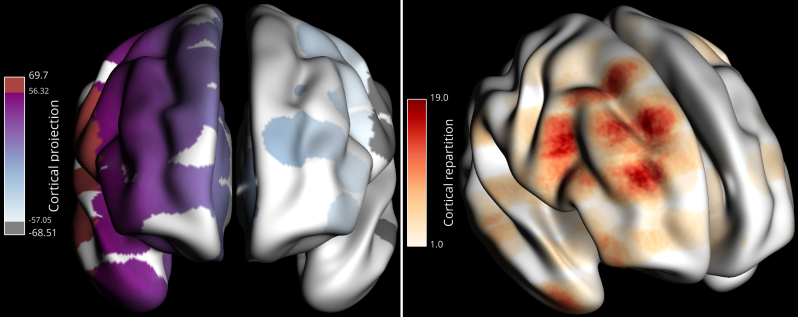
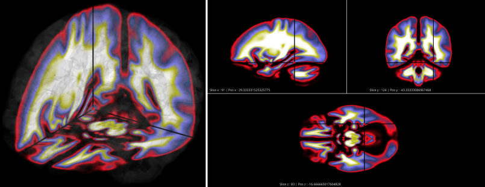
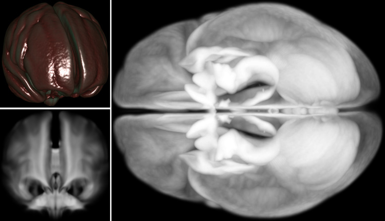

.. _Brain:

Brain
=====

.. figure::  picture/ico/brain_ico.png
   :align:   center

.. ##########################################################################
..                                 DESCRIPTION
.. ##########################################################################

Description
-----------

*Brain* is a flexible graphical user interface for 3D visualizations on an MNI brain. It can be use to display deep sources, connectivity, region of interest...

.. figure::  picture/picbrain/brain_description.png
   :align:   center

Help
~~~~

If you need help with the *Brain* module, ask your questions in the dedicated `gitter Brain chat <https://gitter.im/visbrain-python/Brain?utm_source=share-link&utm_medium=link&utm_campaign=share-link>`_

Main features
~~~~~~~~~~~~~

* **GUI**
   * Modular and responsive GUI
   * Take screenshot with controllable dpi
   * Save the GUI state (*buttons, sliders, checkbox*...) 
* **Main brain templates**
   * Zoom, translate and rotate the brain
   * Control the brain appearance, transparency, hemisphere...
   * Import custom templates
* **Sources**
   * Add sources to the scene (EEG, MEG, intra-cranial...)
   * Control 
   * Connect those sources (*Connectivity* with several color properties)
   * Project source's activity onto the surface
* **Volume**
   * *Brain* comes by default with the Brodmann and AAL volume
   * Import nifti files
   * *Cross-sections*
      * Display brain sections
      * Localize sources using the *cross-sections*
   * 3-D volume using several rendering methods
   * *Region Of Interest* (ROI)
      * Display ROI
      * Add custom ROI templates
      * Project source's activity on ROI

Import and use Brain
~~~~~~~~~~~~~~~~~~~~

The *Brain* module can be imported as follow :

.. code-block:: python

    from visbrain import Brain

Examples and datasets
~~~~~~~~~~~~~~~~~~~~~

Visit this page for a set of `examples <http://visbrain.org/auto_examples/index.html#brain-examples>`_.

GUI description
~~~~~~~~~~~~~~~

Components
^^^^^^^^^^

The *Brain* graphical user interface is subdivided into three main parts :

* **Menu** (*Save/load GUI config, take a screenshot*...)
* **Settings panel** (*display by default*)
* **Main canvas** where the brain is displayed
* **Colorbar canvas** (*hide by default*)
* **Cross-sections canvas** (*hide by default*)

.. note::

   If you want to save the current GUI state (i.e. all buttons properties) and retrieve it later, use the menu File/Save/GUI config and File/Load/GUI config or the associated *Brain* method.
   
   **Examples**
      * :ref:`sphx_glr_auto_examples_brain_13_load_gui_config.py`

   **API**
      * :ref:`LoadSaveConfig`

Settings panel tabs
^^^^^^^^^^^^^^^^^^^

* Settings tab (*background color, object opacity and slice, light*) 
* Brain tab (*brain template, ROI, cross-sections, volume*)
* Sources tab (*source's properties, text, cortical projection and repartition, time-series, pictures*)
* Connect tab (*connectivity settings*)
* Cbar tab (*colorbar properties of the selected object*)

.. _brainshortcuts:

Shortcuts
^^^^^^^^^

==============          ==============================================
Keys                    Description
==============          ==============================================
<space>                 Brain transparency
<delete>                Reset camera
0                       Top view
1                       Bottom view
2                       Left view
3                       Right view
4                       Front view
5                       Back view
b                       Display / hide the brain
x                       Display / hide cross-sections
v                       Display / hide volume
s                       Display / hide sources
t                       Display / hide connectivity
r                       Display / hide Region Of Interest (ROI)
c                       Display / hide colorbar
a                       Auto-scale colormap
"+"                     Increase brain opacity
"-"                     Decrease brain opacity
CTRL + p                Run the cortical projection
CTRL + r                Run the cortical repartition
CTRL + d                Display / hide quick settings panel
CTRL + n                Screenshot window
CTRL + w                Screenshot of the entire window
CTRL + t                Show the shortcuts panel
CTRL + q                Exit
==============          ==============================================

.. ##########################################################################
..                                 TUTORIAL
.. ##########################################################################

Tutorial
--------

MNI templates
~~~~~~~~~~~~~

.. figure::  picture/picbrain/brain_templates.png
   :align:   center

By default, *Brain* comes with three brain templates respectively B1 (with cerebellum), B2 and B3 (smoothest). But this list can be extended using those following functions :

* :ref:`ConvertMeshData` : convert vertices and faces to be compatibles with *Brain*
* :ref:`AddBrainTemplate` and :ref:`RemoveBrainTemplate` : using converted vertices and faces, add/remove the template to visbrain

Further brain templates can be downloaded `here <https://drive.google.com/open?id=0B6vtJiCQZUBvd0xfTHJqcHg2bTA>`_.

.. note::
   
   **Examples**
      * :ref:`sphx_glr_auto_examples_brain_11_convert_mesh_data.py`
      * :ref:`sphx_glr_auto_examples_brain_02_add_brain_template.py`

   **API**
      * :ref:`BrainClass`
      * :ref:`BrainApi`

Sources
~~~~~~~

.. figure::  picture/picbrain/brain_sources.png
   :align:   center

Sources can be added to the scene using (x, y, z) MNI coordinates and comes with a relatively large number of properties (radius, color, shape...). Source's array of coordinates must be have a shape of (N, 3) with **N** the number of sources. In addition, several objects can be attached to sources :

* **Text :** add a text to each source.
* **Source's data :** must be (N,) vector of data (for instance beta power, entropy, amplitude...). The radius of each source is then proportional to the data attached to it. This activity can be projected onto the brain surface using the cortical projection.
* **Connectivity :** must be a (N, N) upper triangular array describing how to connect sources
* **Time-series and/or pictures** : finally, it's also possible to visualize signals (such as time-series, spectral signals...) and 2-D pictures (time-frequency maps, comodulogram...)

.. note::
   
   **Examples**
      * :ref:`sphx_glr_auto_examples_brain_03_sources.py`
      * :ref:`sphx_glr_auto_examples_brain_09_add_multiple_objects.py`

   **API**
      * :ref:`BrainClass`
      * :ref:`SourcesApi`

Cortical projection and repartition
^^^^^^^^^^^^^^^^^^^^^^^^^^^^^^^^^^^

   Cortical projection of source's activity (Left) and source's repartition (Right).

* **Cortical projection :** correspond to the projection of source's activity onto the brain (or ROI) surface.
* **Cortical repartition :** correspond to the number of sources contributing to each vertex of the surface. This is particularly convenient to inspect how sources are distributed on the surface.

Both methods use a **radius** parameter and only vertices with an euclidian distance under **radius** are going to be considered. From the GUI, those functions can be executed from the menu *Project*, from the tab *Sources/Properties/Projection*, using keyboard :ref:`brainshortcuts` or *Brain* methods.

.. note::
   
   **Examples**
      * :ref:`sphx_glr_auto_examples_brain_03_sources.py`
      * :ref:`sphx_glr_auto_examples_brain_08_screenshot.py`
      * :ref:`sphx_glr_auto_examples_brain_12_colorbar_control.py`

   **API**
      * :ref:`CortProj`
      * :ref:`CortRepart`

Connect sources
^^^^^^^^^^^^^^^

.. figure::  picture/picbrain/brain_connect.png
   :align:   center

   Example of connectivity.

Sources can be connected together using connectivity links. *Brain* provides three ways of coloring those links :

* **Strength :** color each link according to the connectivity strength
* **Count :** color each connectivity node according to the number of connections to it
* **Density :** color each link according to the number of existing links in a controllable sphere.

.. note::
   
   **Examples**
      * :ref:`sphx_glr_auto_examples_brain_04_connectivity.py`
      * :ref:`sphx_glr_auto_examples_brain_09_add_multiple_objects.py`

   **API**
      * :ref:`BrainClass`
      * :ref:`ConnectApi`

Attach time-series and/or pictures
^^^^^^^^^^^^^^^^^^^^^^^^^^^^^^^^^^

.. figure::  picture/picbrain/brain_tspic.png
   :align:   center

   Attach time-series (Left) and pictures (Right) to sources.

As a complement, *Brain* provides the ability to visualize directly into the MNI brain time-series and pictures.

.. note::
   
   **Examples**
      * :ref:`sphx_glr_auto_examples_brain_06_add_time_series.py`
      * :ref:`sphx_glr_auto_examples_brain_07_add_pictures.py`

   **API**
      * :ref:`BrainClass`
      * :ref:`TimeSeriesApi`
      * :ref:`PicturesApi`

.. warning::
   
   In the current 0.3.0 visbrain version, time-series and pictures don't rotate with the brain. As a consequence those elements can only be visualized in axial view. This should be solved in next release.

Volume
~~~~~~

Brain templates are surfaces defined by vertices and faces. In contrast, volumes are defined with a 3-D array (Nx, Ny, Nz). There is three scenarios where volumes can be used in *Brain*:

* **Cross-sections :** inspect volumes using slices
* **Region Of Interest (ROI) :** display deep brain regions
* **3-D volume rendering :** use VisPy.visuals.Volume rendering methods (mip, translucent, additive and iso)

Those volumes can be used to visualize nifti, dycom or any image files. By default, *Brain* comes with two volume files : **Brodmann areas** and **Anatomical Automatic Labeling (AAL)**.

Cross-sections
^^^^^^^^^^^^^^

   Cross-sections of a Nifti volume

Cross-sections correspond to an axial, sagittal and coronal slice of the volume and can either be visualize in 3-D (inside the brain template) or in slitted view 

.. note::
   
   **Examples**
      * :ref:`sphx_glr_auto_examples_brain_00_brain_control.py`
      * :ref:`sphx_glr_auto_examples_brain_10_add_nifti_volume.py`

   **API**
      * :ref:`VolCrossecApi`

Region Of Interest (ROI)
^^^^^^^^^^^^^^^^^^^^^^^^

.. figure::  picture/picbrain/brain_roi.png
   :align:   center

   Cortical projection on the thalamus (Left) and cortical repartition on Brodmann area 4 and 6.

If a volume is provided with corresponding labels, ROIs can be extracted and then be transformed into a mesh, compatible with source's projection methods.

.. note::
   
   **Examples**
      * :ref:`sphx_glr_auto_examples_brain_05_region_of_interest.py`
      * :ref:`sphx_glr_auto_examples_brain_08_screenshot.py`

   **API**
      * :ref:`RoiApi`

3-D volume rendering
^^^^^^^^^^^^^^^^^^^^

   Volume rendering methods of a Nifti volume.

.. note::
   
   **Examples**
      * :ref:`sphx_glr_auto_examples_brain_00_brain_control.py`
      * :ref:`sphx_glr_auto_examples_brain_10_add_nifti_volume.py`

   **API**
      * :ref:`VolCrossecApi`

Colorbar control
~~~~~~~~~~~~~~~~

.. figure::  picture/picbrain/brain_cbar.png
   :align:   center

   Colorbar example.

The colorbar can be controlled for individual objects including :

* **Connectivity** (*if defined*)
* **Pictures** (*if defined*)
* **Projections** (*if defined*)

.. note::
   
   **Examples**
      * :ref:`sphx_glr_auto_examples_brain_12_colorbar_control.py`
      * :ref:`sphx_glr_auto_examples_brain_08_screenshot.py`

   **API**
      * :ref:`CbarApi`

.. ##########################################################################
..                                 API
.. ##########################################################################

API
---

The user functions correspond to a bundle of functions that can be used to control Brain operations without opening the graphical interface. This can be convenient to generate a large amount of pictures.

.. toctree::
   :maxdepth: 4

   brainAPI

