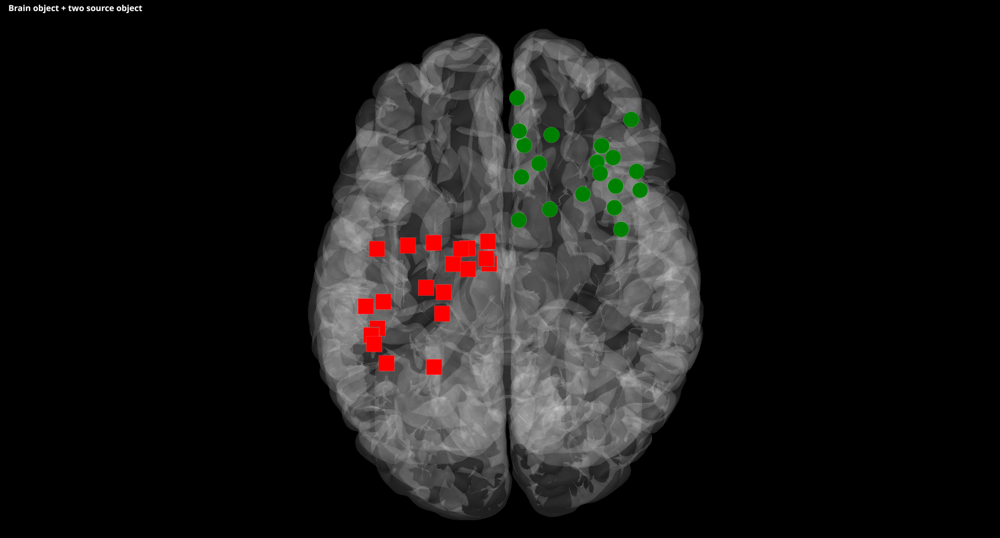

.. _FAQ:

FAQ
***

.. raw:: html

  

    <h1 class="display-3">#nodeepshit</h1>
    
Frequently asked questions

    

  

General
-------

.. ----------------------------- PYTHON -----------------------------
.. raw:: html

    

      

        

          <h2 class="panel-title">
            <a data-toggle="collapse" href="#collapse_python">How can I start with Python and Visbrain?</a>
          </h2>
        

        

          

If you're not a Python user or if you've never used Python, this section is for you.
To install Python, you should try `Anaconda <https://conda.io/docs/index.html>`_ which can be used to manage Python packages and requirement. Then, open a command line window (or terminal) and run :

.. code-block:: bash

    conda install pip

Once pip is installed, you should be able to install Visbrain. In the terminal, run the following command :

.. code-block:: bash

    pip install visbrain

And you should be ready to write your first python script. In your file explorer, create a new file, for example *py_script.py*. Open your file in a notepad like application (or an editor like `Atom <https://atom.io/>`_ or `Sublime Text <https://www.sublimetext.com/>`_). Then, paste the following python code :

.. code-block:: python

    # Import only the Brain module from visbrain
    from visbrain.gui import Brain
    # Open Brain :
    Brain().show()

Finally, inside your terminal navigate to your folder where the *py_script.py* is located and run it using the following command :

.. code-block:: bash

    python py_script.py

.. ----------------------------- HELP -----------------------------
.. raw:: html

          

        

      

    

      

        <h2 class="panel-title">
          <a data-toggle="collapse" href="#collapse_help">Help me I'm lost :(</a>
        </h2>
      

      

        

Checkout the :ref:`community` tab, we provide several Gitter chat rooms where you asked your questions.

.. ----------------------------- MNE -----------------------------
.. raw:: html

          

        

      

    

      

        <h2 class="panel-title">
          <a data-toggle="collapse" href="#collapse_use_mne">I made my analysis with MNE-Python. Can I use visbrain to visualize my results?</a>
        </h2>
      

      

        

Yes, we provide a set of functions to help you with the compatibility with MNE-Python. Checkout :py:mod:`visbrain.mne`:

.. ----------------------------- IMPORT -----------------------------
.. raw:: html

          

        

      

    

      

        <h2 class="panel-title">
          <a data-toggle="collapse" href="#collapse_import">How to import and use visbrain?</a>
        </h2>
      

      

        

.. code-block:: python

    import visbrain                                   # import the full package
    from visbrain.gui import Brain, Sleep             # import modules
    from visbrain.objects import BrainObj, SourceObj  # import objects

.. ----------------------------- JUPYTER -----------------------------
.. raw:: html

          

        

      

    

      

        <h2 class="panel-title">
          <a data-toggle="collapse" href="#collapse_jupyter">Can I use visbrain inside the Jupyter notebook?</a>
        </h2>
      

      

        

Well, to be honest, the following trick doesn't work on every system and you could be forced to use Visbrain inside Python script (.py) or `ipython <https://ipython.org/>`_ instead of notebooks (.ipynb). Try to start your notebook with the following cell :

.. code-block:: python

    import matplotlib
    matplotlib.use("Qt5Agg")

.. raw:: html

          

        

      

    

.. ############################################################################
.. ############################################################################
..                                  OBJECTS
.. ############################################################################
.. ############################################################################

Objects
-------

.. ----------------------------- SINGLE OBJECT -----------------------------
.. raw:: html

    

      

        

          <h2 class="panel-title">
            <a data-toggle="collapse" href="#collapse_objects">How to display individual Visbrain objects?</a>
          </h2>
        

        

          

In Visbrain, objects are elementary visualization bricks. **One object = one visualization type**. Objects can be imported from :class:`visbrain.objects`. For example :

* :class:`visbrain.objects.BrainObj` : plot a brain mesh
* :class:`visbrain.objects.HypnogramObj` : plot an hypnogram
* :class:`visbrain.objects.TimeFrequencyObj` : plot a time-frequency map

Checkout the :py:mod:`visbrain.objects` part of the API. Then, each object has a `.preview()` method to be displayed.

.. code-block:: python

    from visbrain.objects import BrainObj

    # Create a brain object and display it :
    b_obj = BrainObj('B1', translucent=False)

    # Display the brain object :
    b_obj.preview()

.. figure::  _static/tuto/tuto_1.png
   :align:   center

.. ----------------------------- COMBINE OBJECTS -----------------------------
.. raw:: html

          

        

      

    

      

        <h2 class="panel-title">
          <a data-toggle="collapse" href="#collapse_combine">How to combine multiple objects to create complex figures?</a>
        </h2>
      

      

        

Objects can be combined in a scene (see :class:`visbrain.objects.SceneObj`) to create a figure with several panels.

.. raw:: html

    <h3>How to combine objects in separate panels?</h3>

.. code-block:: python

    import numpy as np
    from visbrain.objects import SceneObj, BrainObj, ImageObj, ColorbarObj

    # Create a brain object :
    b_obj = BrainObj('B1', translucent=False)

    # Create a 200x200 image :
    im = np.random.rand(200, 200)
    im_obj = ImageObj('MyImage', data=im, cmap='inferno')

    # Create a colorbar from the image object :
    cb_obj = ColorbarObj(im_obj)

    # Now, create the scene object and add every objects to it :
    sc = SceneObj()
    sc.add_to_subplot(b_obj, row=0, col=0, title='Brain object')
    sc.add_to_subplot(im_obj, row=0, col=1, title='Image object')
    sc.add_to_subplot(cb_obj, row=0, col=2, title='Colorbar object')

    # Finally, display the scene :
    sc.preview()

.. figure::  _static/tuto/tuto_2-1.png
   :align:   center

.. raw:: html

    <h3>How to stack several objects inside the same panel?</h3>

.. code-block:: python

    import numpy as np
    from visbrain.objects import SceneObj, BrainObj, SourceObj

    # Create a brain object :
    b_obj = BrainObj('B1', translucent=True)

    # Create a first source object with red square symbols :
    s1 = np.random.uniform(-50, 0, (20, 3))
    s1_obj = SourceObj('S1', xyz=s1, symbol='square', color='red',
                       radius_min=30)

    # Create a second source object with green disc symbols :
    s2 = np.random.uniform(0, 50, (20, 3))
    s2_obj = SourceObj('S2', xyz=s2, symbol='disc', color='green',
                       radius_min=30)

    # Now, create the scene object and add every objects to it :
    sc = SceneObj()
    sc.add_to_subplot(b_obj, title='Brain object + two source object')
    sc.add_to_subplot(s1_obj)
    sc.add_to_subplot(s2_obj)

    # Finally, display the scene :
    sc.preview()

.. raw:: html

          

        

      

    

.. ############################################################################
.. ############################################################################
..                                    BRAIN
.. ############################################################################
.. ############################################################################

Brain
-----

.. raw:: html

    

      

        

          <h2 class="panel-title">
            <a data-toggle="collapse" href="#collapse_vertices">How to use my own brain template?</a>
          </h2>
        

        

          

The :class:`visbrain.objects.BrainObj` comes with several brain templates (i.e B1, B2, B3 etc.). This is relevant for intracranial data but not always for EEG/MEG data. In that case, you can specify your own vertices and faces and define a new brain template.

.. code-block:: python

  from visbrain.gui import Brain
  from visbrain.objects import BrainObj

  vertices = ...  # the array of vertices
  faces = ...  # the array of faces

  # Sometimes you can also have the normals to faces but visbrain usually have
  # a better visual output when computing normals itself.
  # Now, define a brain object :
  b_obj = BrainObj('Custom', vertices=vert, faces=faces)

  # Then, pass your brain object as an input and use it inside the GUI :
  Brain(brain_obj=b_obj).show()

  # Note : you can also save your template if you want to reload it later
  # checkout the visbrain.objects.BrainObj.save method :
  b_obj.save()

  # After being saved, your template can be reloaded using :
  b_obj = BrainObj('Custom')

For further details, checkout this example : :ref:`sphx_glr_auto_examples_brain_02_brain_using_vertices.py`

.. raw:: html

          

        

      

    

      

        <h2 class="panel-title">
          <a data-toggle="collapse" href="#collapse_export">How to export figures without opening the graphical user interface?</a>
        </h2>
      

      

        

.. raw:: html

          

        

      

    

Sleep
-----

.. raw:: html

    

      

        

          <h2 class="panel-title">
            <a data-toggle="collapse" href="#collapse_sleep_extension">My data extension is not supported :( what can I do?</a>
          </h2>
        

        

          

Two strategies :

* You already have a function to load your data as a NumPy array. In that case :

.. code-block:: python

  from visbrain.gui import Sleep

  data = ...        # NumPy array of shape (n_channels, n_time_points)
  channels = [...]  # List of channel names. Could be None
  hypno = ...       # NumPy array of shape (n_time_points,). Could be None

  Sleep(data=data, hypno=hypno, channels=channels).show()

* Submit a pull request to the `Visbrain Github <https://github.com/EtienneCmb/visbrain>`_

.. ----------------------------- AUTO SCORING -----------------------------
.. raw:: html

          

        

      

    

      

        

          <h2 class="panel-title">
            <a data-toggle="collapse" href="#collapse_auto_scoring">Can Sleep automatically detect sleep stages for me?</a>
          </h2>
        

        

          

Sleep does not yet provide a function to automatically detect and score the sleep stages. However, Sleep can make the tedious process of manually scoring the sleep stages easier for you, by automatically detecting microstructural events such as spindles, slow waves or rapid eye movements. In addition, the multiple customizable parameters of the spectrogram can be very useful to visually detect period of deep sleep, wakefulness, movements...

.. ----------------------------- CUSTOM DETECTION -----------------------------
.. raw:: html

          

        

      

    

      

        

          <h2 class="panel-title">
            <a data-toggle="collapse" href="#collapse_custom_detection">I would rather use my own spindles detection algoritm than the one implemented in Sleep. Is it possible?</a>
          </h2>
        

        

          

            Yes! Sleep offers the possibility to implement your own detection algorithm. Please see the <a href="sleep.html#use-your-own-detections-in-sleep">Sleep documentation</a> for further details.

.. ----------------------------- END -----------------------------
.. raw:: html

          

        

      

    

