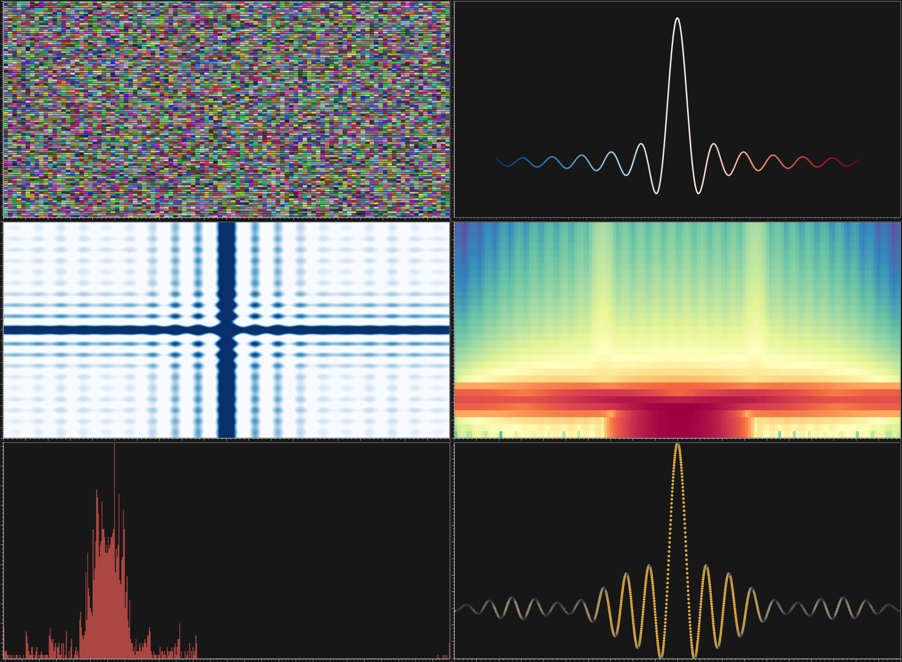

.. _Ndviz:

Ndviz
#####

.. warning::
   The *Ndviz* module could be divided into two separate modules : *NdSignals* et *NdImages*. 

.. figure::  picture/ico/ndviz_ico.png
   :align:   center

Description
-----------

The Ndviz module groups a bundle of functionalities for the visualization of mutli-dimentional data. It can be used to represent all of your signals in a single canvas (see this `example <https://github.com/vispy/vispy/blob/master/examples/demo/gloo/realtime_signals.py>`_ by `Cyrille Rossant <https://github.com/rossant>`_ for the original script). Each single signal can then be ploted as a traditional continious line, a cloud of points, a histogram, a spectrogram or as an image.

Use the following command to import Ndviz :

.. code-block:: python

    from visbrain import Ndviz

Visit this page for a set of `examples <https://github.com/EtienneCmb/visbrain/tree/master/examples/ndviz>`_.

API
------

.. autoclass:: visbrain.ndviz.ndviz.Ndviz

Shortcuts
---------

==============          ==================================================================================
Keys                    Description
==============          ==================================================================================
CTRL+d                  Display quick settings panem
CTRL+n                  Screenshot window
<space>                 Play signals on Nd-plot canvas
r                       Reset signals after playing
0                       Reset camera
1                       Display / hide the Nd-plot canvas
2                       Display / hide the Inspect
g                       Display / hide axis grid
l                       Display the line plot type
m                       Display the marker plot type
s                       Display the spectrogram plot type
h                       Display the histogram plot type
i                       Display the image plot type
a                       Auto-scale colormap
n                       Next signal (for line / marker / histogram / spectrogram)
p                       Previous signal (for line / marker / histogram / spectrogram)
N                       Next signal (for image)
P                       Previous signal (for image)
==============          ==================================================================================