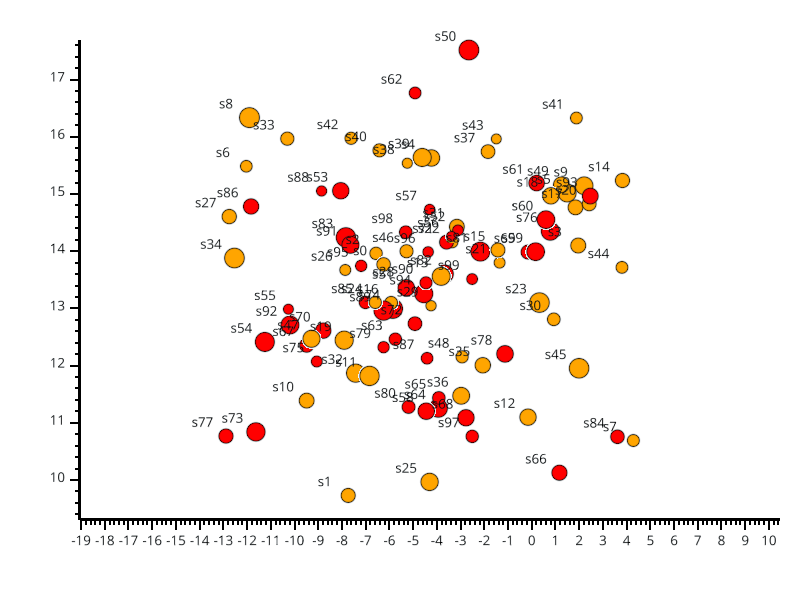
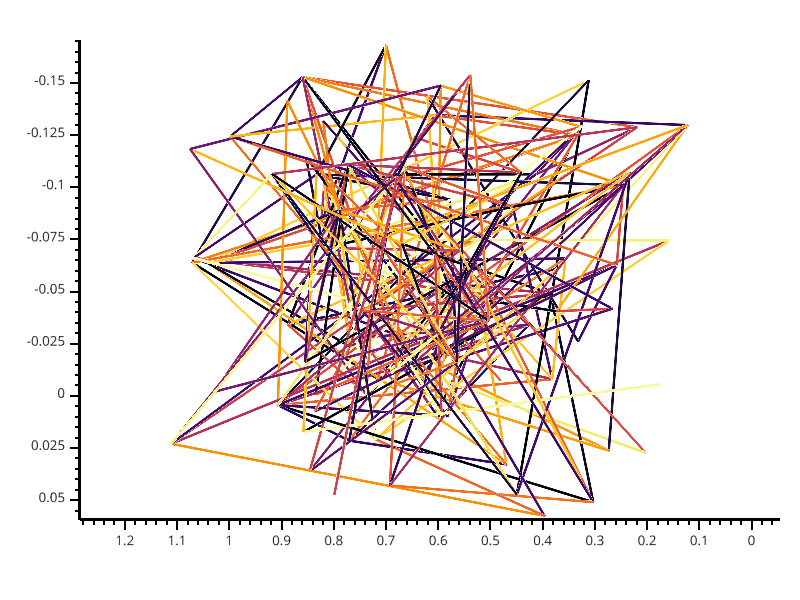
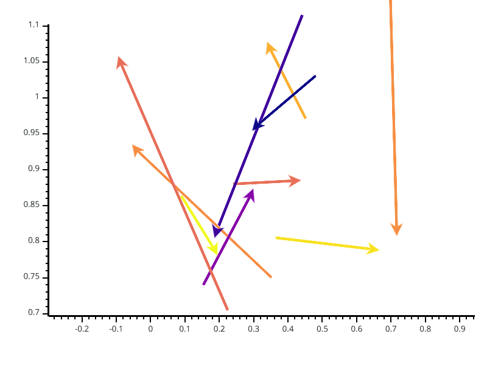
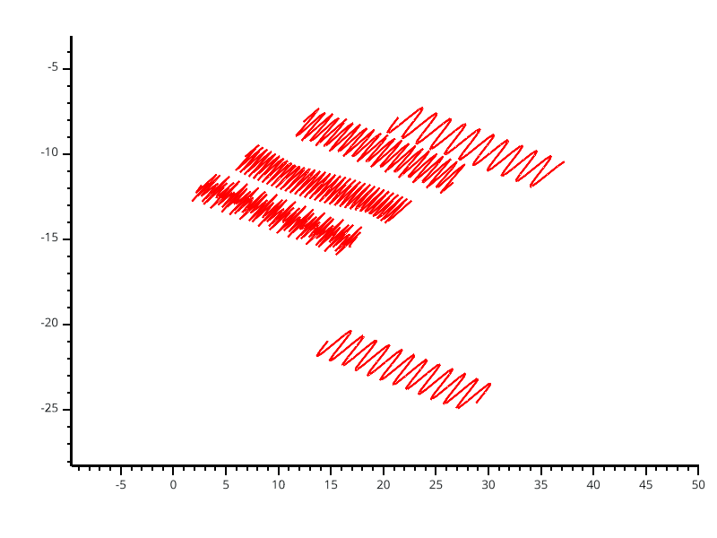
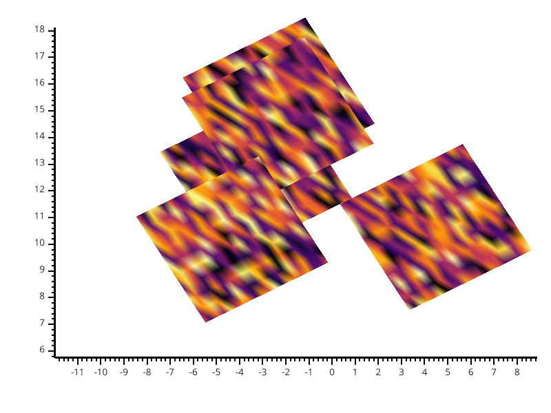

.. _Objects:

Objects
=======

* :ref:`BrainObj`
* :ref:`SourceObj`
* :ref:`ConnectObj`
* :ref:`VectorObj`
* :ref:`TSObj`
* :ref:`PicObj`
* :ref:`RoiObj`

.. _BrainObj:

Brain object
------------

.. figure::  picture/picobjects/pic_brain_obj.png
   :align:   center

   Brain object example

.. currentmodule:: visbrain.objects

.. autoclass:: BrainObj
  :members: preview, set_data, set_state, rotate, add_activation

    .. rubric:: Methods

    .. autosummary::
        ~BrainObj.preview
        ~BrainObj.set_data
        ~BrainObj.set_state
        ~BrainObj.rotate
        ~BrainObj.add_activation

.. include:: generated/visbrain.objects.BrainObj.examples
.. raw:: html

    

.. _SourceObj:

Source object
-------------

   Source object example

.. currentmodule:: visbrain.objects

.. autoclass:: SourceObj
  :members: preview, analyse_sources, color_sources, set_visible_sources, fit_to_vertices, project_modulation, project_repartition

    .. rubric:: Methods

    .. autosummary::
        ~SourceObj.preview
        ~SourceObj.analyse_sources
        ~SourceObj.color_sources
        ~SourceObj.set_visible_sources
        ~SourceObj.fit_to_vertices
        ~SourceObj.project_modulation
        ~SourceObj.project_repartition

.. include:: generated/visbrain.objects.SourceObj.examples
.. raw:: html

    

.. _ConnectObj:

Connectivity object
-------------------

   Connectivity object example

.. currentmodule:: visbrain.objects

.. autoclass:: ConnectObj
  :members: preview

    .. rubric:: Methods

    .. autosummary::
        ~ConnectObj.preview

.. include:: generated/visbrain.objects.ConnectObj.examples
.. raw:: html

    

.. _VectorObj:

Vector object
-------------

   Vector object example

.. currentmodule:: visbrain.objects

.. autoclass:: VectorObj
  :members: preview

    .. rubric:: Methods

    .. autosummary::
        ~VectorObj.preview

.. include:: generated/visbrain.objects.VectorObj.examples
.. raw:: html

    

.. _TSObj:

Time-series object
------------------

   3-D time-series object example

.. currentmodule:: visbrain.objects

.. autoclass:: TimeSeriesObj
  :members: preview

    .. rubric:: Methods

    .. autosummary::
        ~TimeSeriesObj.preview

.. include:: generated/visbrain.objects.TimeSeriesObj.examples
.. raw:: html

    

.. _PicObj:

Pictures object
---------------

   3-D pictures object example

.. currentmodule:: visbrain.objects

.. autoclass:: PictureObj
  :members: preview

    .. rubric:: Methods

    .. autosummary::
        ~PictureObj.preview

.. include:: generated/visbrain.objects.PictureObj.examples
.. raw:: html

    

.. _RoiObj:

Region Of Interest object
-------------------------

.. figure::  picture/picobjects/pic_roi_obj.png
   :align:   center

   Region Of Interest object example

.. currentmodule:: visbrain.objects

.. autoclass:: RoiObj
  :members: preview, change_roi_object, localize_sources, get_roi_vertices

    .. rubric:: Methods

    .. autosummary::
        ~RoiObj.preview
        ~RoiObj.change_roi_object
        ~RoiObj.localize_sources
        ~RoiObj.get_roi_vertices