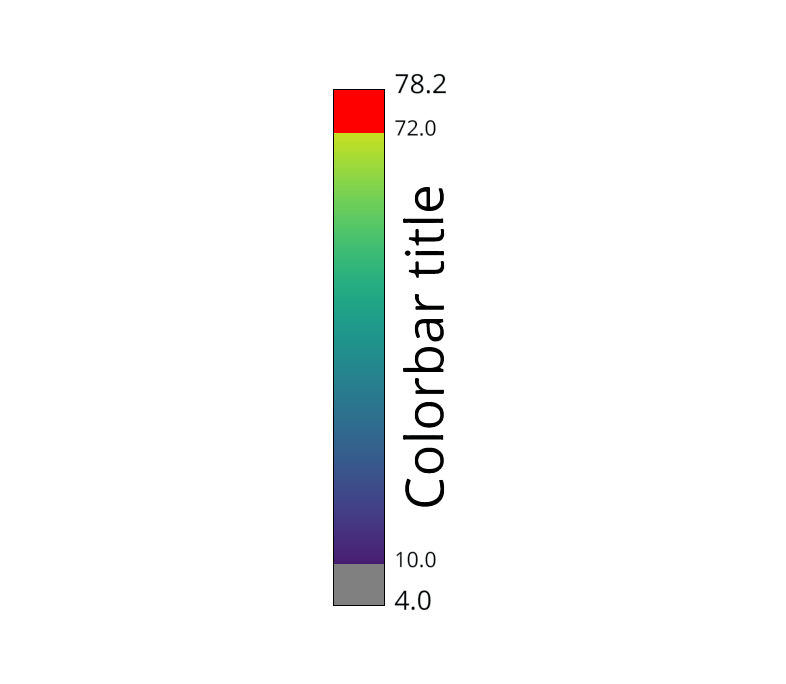
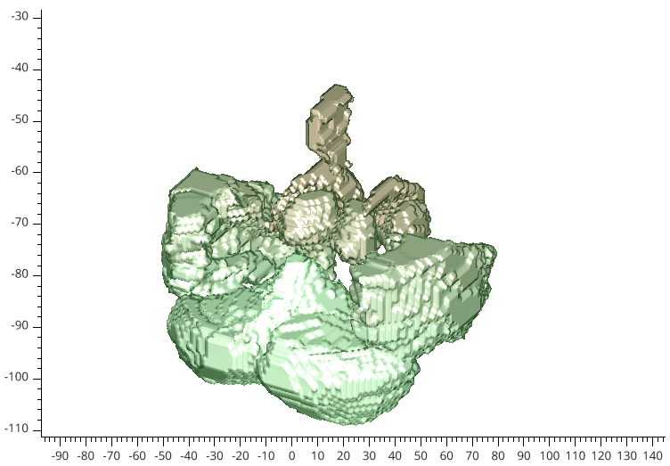
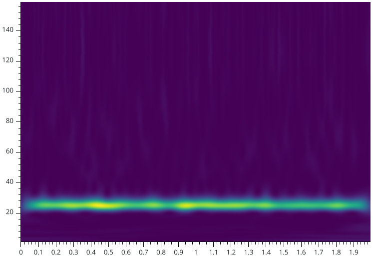

.. _Objects:

Objects
=======

Visbrain's objects are small pieces that can be used to accomplish basic visualizations or can be pass to other Visbrain modules (like :ref:`BrainModule`).

Here's the list of currently supported modules :

* :ref:`SceneObj`
* :ref:`BrainObj`
* :ref:`ColorbarObj`
* :ref:`SourceObj`
* :ref:`ConnectObj`
* :ref:`VectorObj`
* :ref:`TS3DObj`
* :ref:`Pic3DObj`
* :ref:`RoiObj`
* :ref:`VolumeObj`
* :ref:`ImageObj`
* :ref:`TFObj`
* :ref:`SpecObj`

Each object inherit to the following methods :

.. currentmodule:: visbrain.objects

.. autosummary::
    ~VisbrainObject.describe_tree
    ~VisbrainObject.preview
    ~VisbrainObject.screenshot

.. automethod:: VisbrainObject.describe_tree
.. automethod:: VisbrainObject.preview
.. automethod:: VisbrainObject.screenshot

.. _SceneObj:

Scene object
------------

.. currentmodule:: visbrain.objects

.. autoclass:: SceneObj
  :members: add_to_subplot, link

    .. rubric:: Methods

    .. autosummary::
        ~SceneObj.add_to_subplot
        ~SceneObj.link

.. include:: generated/visbrain.objects.SceneObj.examples
.. raw:: html

    

.. _BrainObj:

Brain object
------------

.. figure::  picture/picobjects/pic_brain_obj.png
   :align:   center

   Brain object example

.. currentmodule:: visbrain.objects

.. autoclass:: BrainObj
  :members: set_data, rotate, project_sources, add_activation, get_parcellates, parcellize

    .. rubric:: Methods

    .. autosummary::
        ~BrainObj.set_data
        ~BrainObj.rotate
        ~BrainObj.project_sources
        ~BrainObj.add_activation
        ~BrainObj.get_parcellates
        ~BrainObj.parcellize

.. include:: generated/visbrain.objects.BrainObj.examples
.. raw:: html

    

.. _ColorbarObj:

Colorbar object
---------------

   Colorbar object example

.. currentmodule:: visbrain.objects

.. autoclass:: ColorbarObj

.. include:: generated/visbrain.objects.ColorbarObj.examples
.. raw:: html

    

.. _SourceObj:

Source object
-------------

.. figure::  picture/picobjects/pic_source_obj.png
   :align:   center

   Source object example

.. currentmodule:: visbrain.objects

.. autoclass:: SourceObj
  :members: analyse_sources, color_sources, set_visible_sources, fit_to_vertices, project_sources

    .. rubric:: Methods

    .. autosummary::
        ~SourceObj.analyse_sources
        ~SourceObj.color_sources
        ~SourceObj.set_visible_sources
        ~SourceObj.fit_to_vertices
        ~SourceObj.project_sources

.. include:: generated/visbrain.objects.SourceObj.examples
.. raw:: html

    

.. _ConnectObj:

Connectivity object
-------------------

.. figure::  picture/picobjects/pic_connect_obj.png
   :align:   center

   Connectivity object example

.. currentmodule:: visbrain.objects

.. autoclass:: ConnectObj

.. include:: generated/visbrain.objects.ConnectObj.examples
.. raw:: html

    

.. _VectorObj:

Vector object
-------------

.. figure::  picture/picobjects/pic_vector_obj.png
   :align:   center

   Vector object example

.. currentmodule:: visbrain.objects

.. autoclass:: VectorObj

.. include:: generated/visbrain.objects.VectorObj.examples
.. raw:: html

    

.. _TS3DObj:

Time-series 3D object
---------------------

.. figure::  picture/picobjects/pic_ts_obj.png
   :align:   center

   3-D time-series object example

.. currentmodule:: visbrain.objects

.. autoclass:: TimeSeries3DObj

.. include:: generated/visbrain.objects.TimeSeries3DObj.examples
.. raw:: html

    

.. _Pic3DObj:

Pictures 3D object
------------------

.. figure::  picture/picobjects/pic_picture_obj.png
   :align:   center

   3-D pictures object example

.. currentmodule:: visbrain.objects

.. autoclass:: Picture3DObj

.. include:: generated/visbrain.objects.Picture3DObj.examples
.. raw:: html

    

.. _RoiObj:

Region Of Interest object
-------------------------

.. figure::  picture/picobjects/pic_roi_obj.png
   :align:   center

   Region Of Interest object example

.. currentmodule:: visbrain.objects

.. autoclass:: RoiObj
  :members: change_roi_object, localize_sources, get_roi_vertices

    .. rubric:: Methods

    .. autosummary::
        ~RoiObj.change_roi_object
        ~RoiObj.localize_sources
        ~RoiObj.get_roi_vertices

.. _VolumeObj:

Volume object
-------------

   Volume object example

.. currentmodule:: visbrain.objects

.. autoclass:: VolumeObj
  :members: __call__, set_data

    .. rubric:: Methods

    .. autosummary::
        ~VolumeObj.__call__
        ~VolumeObj.set_data

.. _ImageObj:

Image object
------------

.. figure::  picture/picobjects/pic_image_obj.png
   :align:   center

   Image object example

.. currentmodule:: visbrain.objects

.. autoclass:: ImageObj
  :members: set_data

    .. rubric:: Methods

    .. autosummary::
        ~ImageObj.set_data

.. include:: generated/visbrain.objects.ImageObj.examples
.. raw:: html

    

.. _TFObj:

Time-frequency map object
-------------------------

   Time-frequency map object example

.. currentmodule:: visbrain.objects

.. autoclass:: TimeFrequencyMapObj
  :members: set_data

    .. rubric:: Methods

    .. autosummary::
        ~TimeFrequencyMapObj.set_data

.. include:: generated/visbrain.objects.TimeFrequencyMapObj.examples
.. raw:: html

    

.. _SpecObj:

Spectrogram object
------------------

.. figure::  picture/picobjects/pic_spec_obj.png
   :align:   center

   Spectrogram object example

.. currentmodule:: visbrain.objects

.. autoclass:: SpectrogramObj
  :members: set_data

    .. rubric:: Methods

    .. autosummary::
        ~SpectrogramObj.set_data

.. include:: generated/visbrain.objects.SpectrogramObj.examples
.. raw:: html

    

