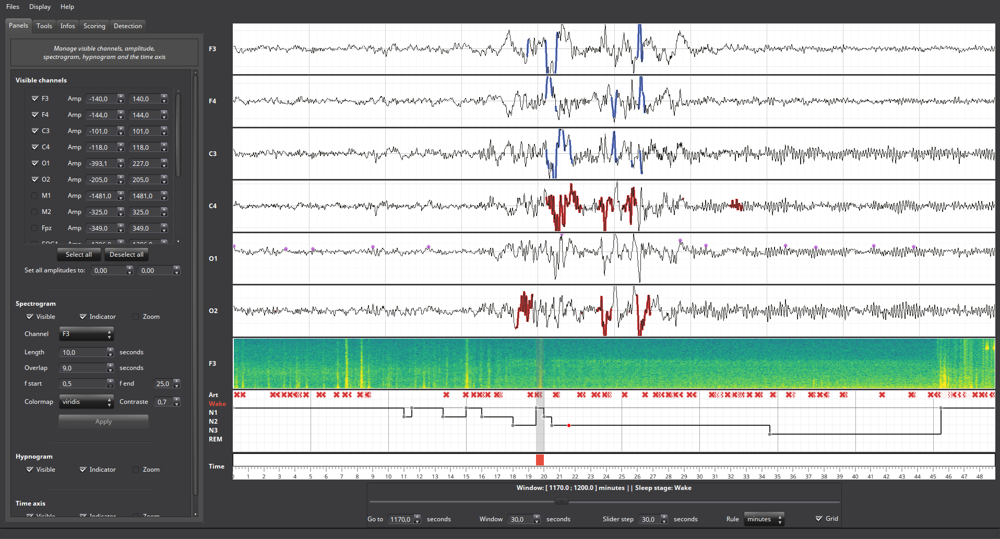
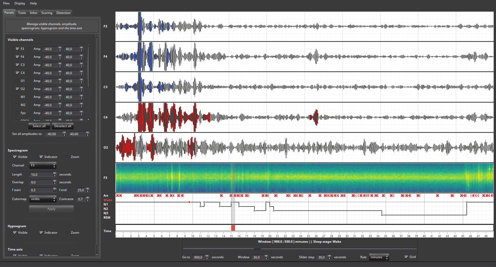
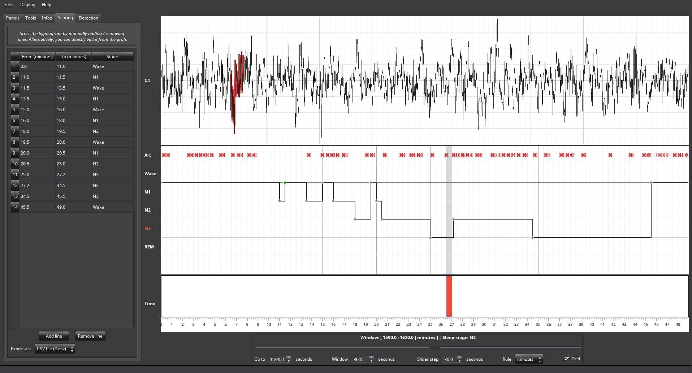
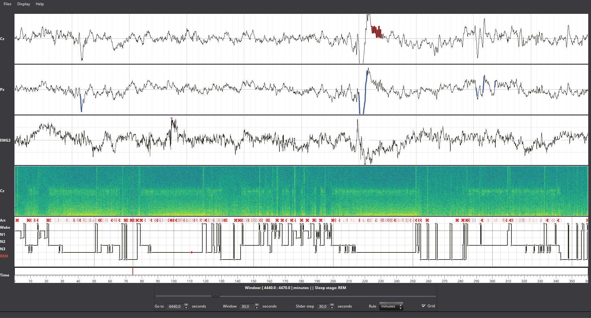

.. _Sleep:

Sleep
=====

Description
-----------

   The Sleep module: individual control of each channel.

Sleep is a new graphical user interface dedicated to sleep data. Here'a some of the most relevant features :

* Display / hide data channel, spectrogram and hypnogram. All the channels can be visualized at the same time.
* Edit and save the hypnogram (either using the "Scoring" panel or directly from the hypnogram graph)
* Perform spindles / REM / Peak detection on multiple channels and report where each one of them on the hypnogram or inside a table. Each detection offer a few more control in order to improve the detection.
* Get relevant informations about data while editing (duration of each stage, latencies...)
* Futher signal processing tools (de-mean, de-trend, filtering...). Those tools are directly apply to each channel and to the spectrogram
* A lot a visual helper to quickly see where you are in the data and in which sleep stage.

The Sleep module can be imported as follow :

.. code-block:: python

    from visbrain import Sleep

   Bandpass filtering example.

Supported files and format
--------------------------

Sleep support by default several data and hypnogram files. 

Data files
~~~~~~~~~~

Here's the list of supported extensions for data files : 

* **.eeg** (Brainvision)
* **.eeg** (ELAN)
* **.edf**

.. note::

   The extensions above are files that are natively supported inside Sleep. But, tha data can be directly pass to the Sleep module if you load them before.

Hypnogram
~~~~~~~~~

Here's the list of supported extensions for hypnogram files : 

* **.hyp**
* **.txt**
* **.csv**

.. warning::

   In order to be recognized, the hypnogram has to be formated in the propper way (see *Iber et al. 2007*). Each sleep stage must be a integer refering to :

   * **Wake**:   0
   * **N1**:     1
   * **N2**:     2
   * **N3**:     3
   * **REM**:    4
   * **Art**:    -1  (*optional*)

Load your files
---------------

There is three way for loading your files :

- **Load from the GUI**:
- **Load from path**:
- **Load raw data**:

From the GUI
~~~~~~~~~~~~

Don't send anything, just open the interface and you will have a popup window asking for the filename of your data and hypnogram

.. code-block:: python

    # Import the Sleep module from visbrain :
    from visbrain import Sleep
    # Run the interface :
    Sleep().show()

.. figure::  picture/Sleep_open.png
   :align:   center

   Popup window for loading your files.

From path
~~~~~~~~~

Instead of leaving inputs arguments empty, send the path to the data :

.. code-block:: python

    # Import the Sleep module from visbrain :
    from visbrain import Sleep
    # Define where the data are located :
    dfile = '/home/perso/myfile.eeg'
    # File for the hypogram :
    hfile = '/home/perso/hypno.hyp'
    # You're not forced to give a hypnogram. If you prefer to start from a fresh empty one, use :
    # hfile = None or ignore passing this argument.
    Sleep(file=dfile, hypno_file=hfile).show()

Raw data
~~~~~~~~

This third way is the manually one. You have to load your data before and sending it to the sleep module. This may seems to be more difficult but it allow advanced user to pass any kind of data :

.. code-block:: python

    # Import the Sleep module from visbrain :
    from visbrain import Sleep
    # Load your dataset :
    mat = loadmat('testing_database.mat')
    # Get the data, sampling frequency and channel names :
    raw_data = mat['data']
    raw_sf = mat['sf']
    raw_channels = mat['channels']
    # For the hypnogram :
    raw_hypno = mat['hypno']
    # As before, if you prefer to start from a fresh empty one, use :
    # raw_hypno = None or ignore passing this argument.
    # Now, pass all the arguments to the Sleep module :
    Sleep(data=raw_data, sf=raw_sf, channels=raw_channels,
          hypno=raw_hypno).show()

.. warning::

   Data shapes

Hypnogram scoring
-----------------

Sleep offer the possibility to score the hypnogram, either manually using the :ref:`scoretab` or :ref:`liveedit`. Both methods are always kept synchronized.

   Hypnogram scoring.

.. _scoretab:

Scoring table
~~~~~~~~~~~~~

The Scoring panel can be used to manually edit the hypnogram values. It contains three columns : 

* **From** : specify where the stage start (*in minutes*)
* **To** : specify where the stage finish (*in minutes*)
* **Stage** : the stage type (use Art, Wake, N1, N2, N3 or REM. Can be lowercase)

At the end of the hypnogram, you can **Add line** or **Remove line** when a line is selected. An other interesting option is that the table is sortable (by clicking on the arrow inside the column name).

Then, you can export your hypnogram in **.hyp**, **.txt** or **cvs**.

.. figure::  picture/Scoring_table.png
   :align:   center

   Hypnogram scoring using the Scoring table. Manually specify where each stage start / finish and precise the stage type.

.. _liveedit:

Live editing
~~~~~~~~~~~~

Live editing consist of editing your hypnogram directly from the axis by adding / selecting / dragging points. Unused points will be automatically destroyed. 

	- Your cursor is red. Existing points are set in gray.
	- Double click on the hypnogram to add points
	- Hover an existing point in order to select it (the point turn green)
	- Dragg the point (blue) on the diffrent hypnogram values

.. figure::  picture/Sleep_livedit.png
   :align:   center

   Edit the hypnogram directly from the axes.

Spindles / REM / Peak detection
-------------------------------

   REM / Spindle and peak detection.

Additional inputs
-----------------

.. autoclass:: visbrain.sleep.sleep.Sleep

Shortcuts
---------

==============          ==================================================================================
Keys                    Description
==============          ==================================================================================
CTRL+d                  Display quick settings panel
CTRL+n                  Screenshot window
0                       Display / hide spectrogram
1                       Display / hide hypnogram
z                       Enable / disable zoom
b                       Previous window
n                       Next window
mouse wheel             Move the current window
==============          ==================================================================================