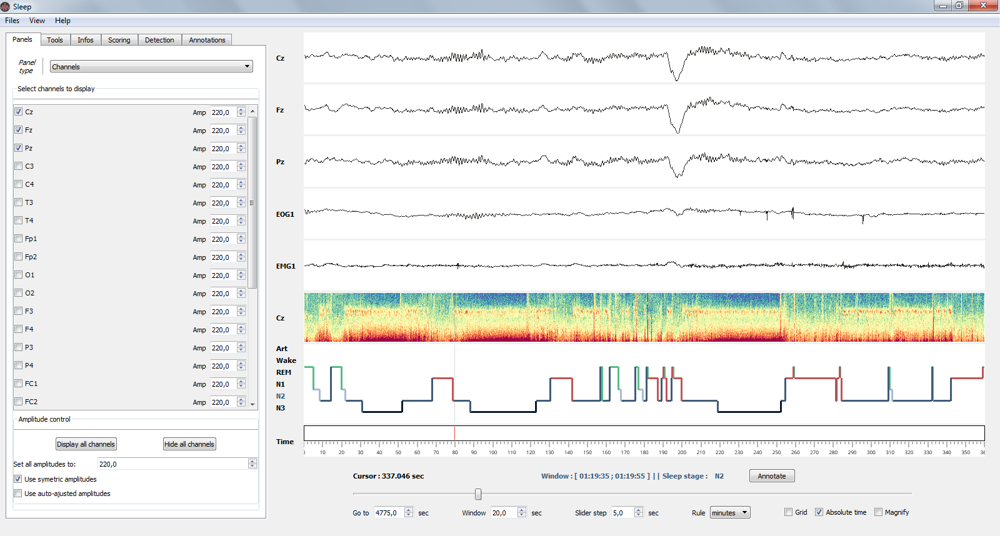
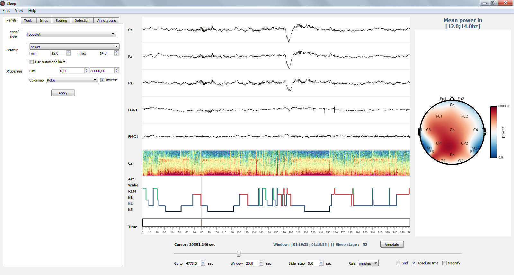
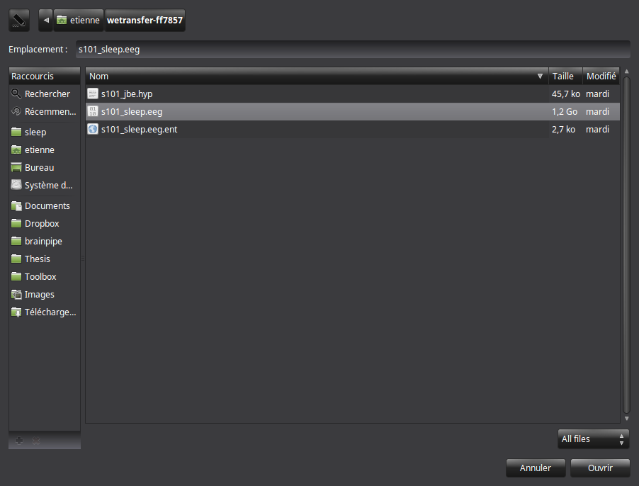
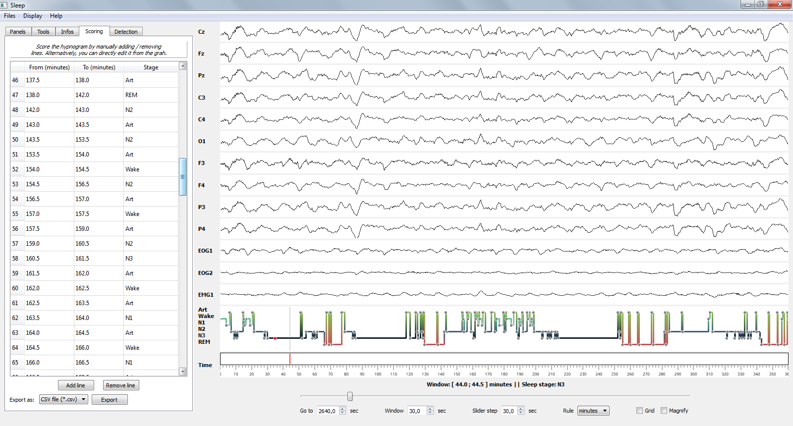
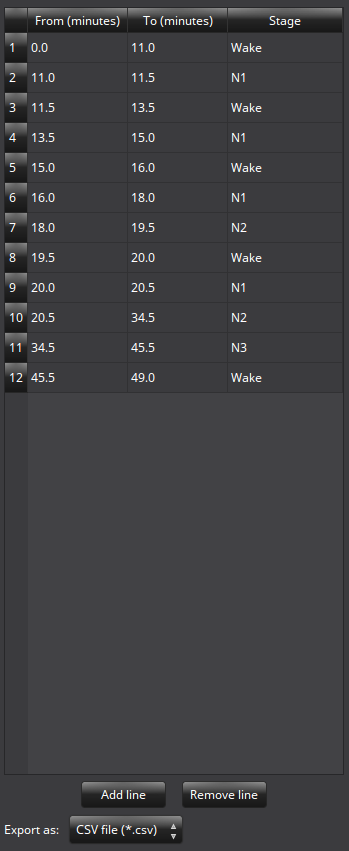
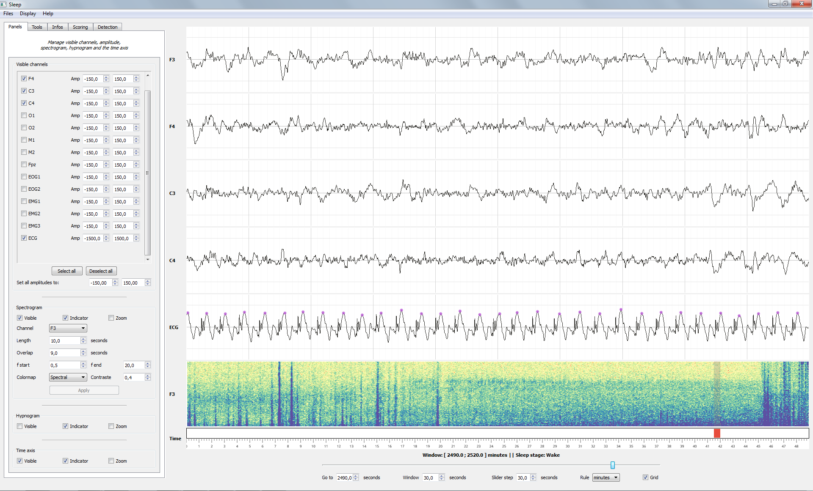

.. _Sleep:

Sleep
=====

.. figure::  picture/ico/sleep_ico.png
   :align:   center

.. ##########################################################################
.. ##########################################################################
..                                 DESCRIPTION
.. ##########################################################################
.. ##########################################################################

Description
-----------

Sleep is a graphical user interface dedicated to visualization and scoring of sleep data. Sleep runs on `Vispy <http://vispy.org/>`_ excellent package and benefits thus from the high-performance of this latter (GPU-based computation).

Help
~~~~

If you need help with the *Sleep* module, ask your questions in the dedicated `gitter Sleep chat <https://gitter.im/visbrain-python/Sleep?utm_source=share-link&utm_medium=link&utm_campaign=share-link>`_

Main features
~~~~~~~~~~~~~

* **GUI**
    * Modular and responsive GUI
    * Take screenshot with controllable dpi
    * Save the GUI state (*buttons, sliders, checkbox*...)
* **Load standard electro physiological files**
    * Default supported files : **.vhdr** (BrainVision V1 and 2), **.edf** (European Data Format), **.trc** (Micromed), **.eeg** (ELAN)
    * Pass raw data, or use MNE-python to load other `non natively supported files <https://martinos.org/mne/dev/manual/io.html#importing-eeg-data>`_
    * Supported extensions for hypnogram files : **.txt**, **.csv**, **.hyp** or directly use raw data.
* **Display**
    * Polysomnographic data (*with individual amplitude control*)
    * Spectrogram (*with several controllable parameters such as frequency, channel, colormap*...)
    * Hypnogram
    * Topoplot
* **Hypnogram**
    * Load, edit and save
    * Real-time computation of sleep statistics
    * Export the hypnogram as a color or black-and-white traditional figure
* **Semi-automatic detection and signal processing functions**
    * Implemented methods : sleep spindles, K-complexes, slow waves, rapid eye movements, muscle twitches and peak detection (*each detection comes with additional and controllable parameters*)
    * Can be performed either on single or multiple channels
    * Detections are reported on the hypnogram and inside a table
    * Signal processing tools such as de-mean, de-trend and filtering

Import and use sleep
~~~~~~~~~~~~~~~~~~~~

The *Sleep* module can be imported as follow :

.. code-block:: python

    from visbrain import Sleep

Examples and datasets
~~~~~~~~~~~~~~~~~~~~~

To try out in the absence of sleep data, please check out some `sleep example <http://visbrain.org/auto_examples/index.html#sleep-examples>`_ scripts and datasets on `Google drive <https://drive.google.com/drive/folders/0B6vtJiCQZUBvRjc3cFFYcmFIeW8?usp=sharing>`_

GUI description
~~~~~~~~~~~~~~~

Components
^^^^^^^^^^

The *Sleep* interface is divided into N parts :

* **Menu** : load and save files (GUI configuration, screenshot...), control which object to display / hide, open the documentation...
* **Canvas** :
    * One individual canvas per channel
    * One canvas for the spectrogram
    * One canvas for the hypnogram
    * One canvas for the time axis
    * One canvas for the topoplot (*hidden by default*)
* **Ruler** :
    * *Go to* : go to the time location of your choice
    * *Window* : length of the displayed time window
    * *Slider step* : step between each consecutive window
    * *Rule* : display unit in second, minute or hours
    * *Grid* : display the grid on the hypnogram and channel plot
    * *Magnify* : apply a zoom on the signal (e.g. useful to examine short events such as spindles). Alternatively, you can use CTRL + click at any time to zoom on a specific signal and time point.
* **Settings panel** : for all setting controls, functions to run... See the section :ref:`sleep_settings_panel` for a description of each tab.

.. _sleep_settings_panel:

Settings panel tabs
^^^^^^^^^^^^^^^^^^^

Sleep provide five settings tabs :

* :ref:`paneltab` : manage object visibility, channel's amplitudes, spectrogram properties...
* :ref:`toolstab` : a bundle of signal processing tools (*e.g filtering, re-referencing*)
* :ref:`infotab` : sleep statistics and basic infos on the EEG recording
* :ref:`scoringtab` : a scoring table that can be used to edit the hypnogram
* :ref:`detectiontab` : automatic detection of sleep spindles, rapid eye movements (REMs), slow waves, K-complexes (KCs) and peaks
* :ref:`annotationtab` : manage annotations

.. _paneltab:

Panels
++++++

Manage object visibility, channel's amplitudes, spectrogram properties...

* *Channels*
    * Show / hide channels :
        *  Select channels of your choice by clicking on the corresponding checkbox
        * Display / hide all channels
    * Control the amplitude :
        * Per channel
        * By setting all amplitudes at once
        * Use symmetric amplitudes (-M, +M)
        * Use automatic amplitude (each amplitude fit to the (minimum, maximum) of the current displayed window)
* *Spectrogram*
    * Control spectrogram looking and properties
        * the channel on which compute spectrogram
        * tarting and ending frequencies
        * time length window and overlap
        * colormap
    * Display and zoom
        * Show / hide spectrogram, hypnogram, time axis
        * Display / hide visual indicators referring to the current time window
        * Zoom : when zooming, the axis will fit to the time window according to the (window, step) parameters defined in the ruler
* **Topoplot**
    * Display and properties
        * Show / hide topoplot
        * Display either the filtered signal, the amplitude or the power in specific frequency band
        * Colormap control

.. _toolstab:

Tools
+++++

Signal processing and re-referencing tools.

.. figure::  picture/picsleep/sleep_filtering.png
   :align:   center

   Bandpass filter applied across all channels and spectrogram.

* Signal processing (*apply in real time*)
    * Apply de-meaning and de-trending
    * filtering* and re-referencing which are applied directly on the signal and spectrogram (see image below).
* Re-referencing
    * Common average
    * Bipolarization (for intra-cranial EEG data)

.. _infotab:

Info
++++

The Info panel displays the recording infos (e.g. name and downsampling frequency) as well as the main sleep statistics computed with the hypnogram (see specs below). These values are adjusted in real-time when you edit the hypnogram. Sleep statistics can be exported to **.csv** or **.txt** file.

.. figure::  picture/picsleep/sleep_info.png
   :align:   center

   Sleep statistics.

* File properties
    * Sampling frequency
    * Down-sampling frequency
* Sleep statistics(*All values are expressed in minutes*):
    * Time in Bed (TIB) : total duration of the hypnogram.
    * Total Dark Time (TDT) : duration of the hypnogram from beginning to last period of sleep.
    * Sleep Period Time (SPT) : duration from first to last period of sleep.
    * Wake After Sleep Onset (WASO) : duration of wake periods within SPT
    * Sleep Efficiency (SE) : TST / TDT * 100 (%).
    * Total Sleep Time (TST) : SPT - WASO.
    * W, N1, N2, N3 and REM : sleep stages duration.
    * Latencies : latencies of sleep stages from the beginning of the record.

.. _scoringtab:

Scoring
+++++++

This tab contains the scoring table, i.e. where each stage start and finish. For further informations about how to score your hypnogram see : :ref:`hypnogram_scoring`

.. _detectiontab:

Detections
++++++++++

Perform semi-automatic detection. For a full tutorial about detections see : :ref:`apply_detection`

.. _annotationtab:

Annotations
+++++++++++

Add and edit annotations (annotations are defined by a start and end point, as well as an optional text marker). To quickly add annotations :

* Use the *Annotate* button in the ruler to annotate the entire window
* Double click (with left mouse button) on a canvas to add an annotation starting and finishing at the mouse cursor location.

If you want to import / export annotations, see the :ref:`import_annotation` section.

Shortcuts
^^^^^^^^^

Sleep comes with a bundle of shortcuts that can be used to speed up your productivity. If shortcuts don't seems to be active, simply click on a canvas before.

===================     =======================================================
Keys                    Description
===================     =======================================================
mouse wheel             Move the current window
double left click       Add annotation under mouse cursor
\-                      Decrease amplitude
\+                      Increase amplitude
a                       Score the current epoch as Artefact
w                       Score the current epoch as Wake
1                       Score the current epoch as N1
2                       Score the current epoch as N2
3                       Score the current epoch as N3
r                       Score the current epoch as REM
b                       Previous window
n                       Next window
s                       Display / hide spectrogram
t                       Display / hide topoplot
h                       Display / hide hypnogram
p                       Display / hide navigation bar
x                       Display / hide time axis
g                       Display / hide grid
z                       Enable / disable zoom
i                       Enable / disable indicators
CTRL + Num              Display / hide the channel Num [0, 9]
CTRL + left click       On a channel canvas, magnify signal under mouse location
CTRL + d                Display quick settings panel
CTRL + s                Save hypnogram
CTRL + n                Screenshot window
CTRL + e                Display documentation
CTRL + t                Display shortcuts window
CTRL + q                Close the window
===================     =======================================================

.. ##########################################################################
.. ##########################################################################
..                                 TUTORIAL
.. ##########################################################################
.. ##########################################################################

Tutorial
--------

.. ----------------------------------------------------------------------------
..                              SUPPORTED FILES
.. ----------------------------------------------------------------------------

Supported files and format
~~~~~~~~~~~~~~~~~~~~~~~~~~

Sleep support by default several data formats for both electrophysiological and hypnogram data.

Data files
^^^^^^^^^^

Here’s the list of natively supported file formats :

* **.vhdr** (BrainVision version 1 and 2)
* **.edf** (European Data Format)
* **.trc** (Micromed version 4)
* **.eeg** (`ELAN <http://elan.lyon.inserm.fr>`_)

If MNE-python is installed, this list is extended to (see `also <https://martinos.org/mne/dev/manual/io.html#importing-eeg-data>`_):

 * **.bdf**
 * **.gdf**
 * **.egi**
 * **.mff**
 * **.set** (EEGLAB)
 * **.cnt**
 * **.vhdr** (*BrainVision files can be loaded using either the native library of Sleep or using MNE*)

.. note::
    If MNE-python is installed on your computer, the loading of these file formats is transparent for users. It means that you can load these file formats directly using Sleep graphical user interface or command-line, without any additional steps. We therefore strongly recommand to `install MNE-python <https://martinos.org/mne/stable/index.html>`_.

.. note::
   If you have a file format that is currently not supported, *Sleep* also provide the ability to directly pass raw data (NumPy array). Please click see this example of how to `to load a Matlab <http://visbrain.org/auto_examples/sleep/load_matlab.html#sphx-glr-auto-examples-sleep-load-matlab-py>`_ file and then pass the data directly to Sleep.

.. warning::
   Sleep applies an automatic downsampling to (100 Hz by default) upon loading. You can change this value with the “downsample” argument of Sleep.

Hypnogram
^^^^^^^^^

Here's the list of supported extensions for hypnogram files :

* **.txt**
* **.csv**
* **.hyp** (`ELAN <http://elan.lyon.inserm.fr>`_)

.. warning::
   There is no international gold standard for the hypnogram format yet and each lab can have its own format. To overcome problems caused by different sampling rate of hypnogram files and/or different values assigned to each sleep stages, Sleep requires that you specify these parameters in a .txt file. This text file should be in the same directory as the original hypnogram file and be named: *HYPNOFILENAME_description.txt*. Checkout this `example <https://github.com/EtienneCmb/visbrain/tree/master/docs/Hypnogram_excerpt2_description.txt>`_.

   **This text file should contain the following information :**

   ==========    ======  ======================================================
   Parameters    Values  Description
   ==========    ======  ======================================================
   Time          1       Hypnogram file contains one value per second
   Wake          0       The value assigned to Wake in the hypnogram is 0
   N1            1       The value assigned to N1 sleep in the hypnogram is 1
   N2            2       The value assigned to N2 sleep in the hypnogram is 2
   N3            3       The value assigned to N3 sleep in the hypnogram is 3
   REM           4       The value assigned to REM in the hypnogram is 4
   Artefact      \-1     The value assigned to Artefact in the hypnogram is \-1
   ==========    ======  ======================================================

   Please note that Sleep uses the guidelines of *Iber et al. 2007* for sleep stage nomenclature, i.e. Wake, N1, N2, N3, REM and Artefact. If your hypnogram includes both NREM-S3 and NREM-S4 sleep stages you can add “N4” categories with the corresponding values in the description file. However, keep in mind that S3 and S4 will be merged into N3 during the import to the Sleep module. That also means that if you load and then save your hypnogram in Sleep, you will loose differentiation between S3 and S4 so be sure not to overwrite your original file!

Save hypnogram
^^^^^^^^^^^^^^

By default, Sleep will save your hypnogram with a sampling rate of 1 value per second, and with the following values assigned to each sleep stages:

==============          =================
Stage                    Value
==============          =================
**Wake**                 0
**N1**                   1
**N2**                   2
**N3**                   3
**REM**                  4
**Art**                  \-1  (optional)
==============          =================

Elan .hyp format
++++++++++++++++

Sleep will create a single .hyp file with 4 header rows and the values presented above for the sleep stages, with the exception that the value assigned to REM sleep will be 5 for compatibility with Elan hypnogram reader.

.txt format
+++++++++++

Sleep will automatically create a HYPNOFILENAME_description.txt with the appropriate parameters (time, sleep stages values), therefore making it easy to reload it later.

.. ----------------------------------------------------------------------------
..                              LOAD FILES
.. ----------------------------------------------------------------------------

Load your files
~~~~~~~~~~~~~~~

There are four ways to load datasets into Sleep:

* :ref:`loadfromgui`
* :ref:`loadfrompath`
* :ref:`loadfromraw`
* :ref:`loadfrommne`

.. _loadfromgui:

Load file from the GUI
^^^^^^^^^^^^^^^^^^^^^^

Don't send anything, just open the interface and you will have a popup window asking for the filename of your data and hypnogram. If you do not have a hypnogram for your data and/or wish to display only the data, just press Cancel when the hypnogram popup opens.

.. code-block:: python

    # Import the Sleep module from visbrain :
    from visbrain import Sleep
    # Run the interface :
    Sleep().show()

   Popup window for loading your files.

.. _loadfrompath:

Load file from path
^^^^^^^^^^^^^^^^^^^

Instead of leaving inputs arguments empty, send the path to the data :

.. code-block:: python

    # Import the Sleep module from visbrain :
    from visbrain import Sleep
    # Define where the data are located :
    dfile = '/home/perso/myfile.eeg'
    # File for the hypogram :
    hfile = '/home/perso/hypno.hyp'
    # If you prefer to start with an empty hypnogram, just pass :
    # hfile = None
    Sleep(data=dfile, hypno=hfile).show()

.. _loadfromraw:

Load file from raw data
^^^^^^^^^^^^^^^^^^^^^^^

It is possible to manually load raw data and pass them as inputs arguments Sleep. The code below show how to extract raw data from a Matlab .mat file (using SciPy):

.. code-block:: python

	from scipy.io import loadmat
    # Import the Sleep module from visbrain:
    from visbrain import Sleep
    # Load your dataset :
    mat = loadmat('testing_database.mat')
    # Get the data, sampling frequency and channel names:
    raw_data, raw_sf, raw_channels = mat['data'], mat['sf'], mat['channels']
    # For the hypnogram :
    raw_hypno = mat['hypno']
    # As before, if you prefer to start from a fresh empty one, use:
    # raw_hypno = None or ignore passing this argument.
    # Now, pass all the arguments to the Sleep module:
    Sleep(data=raw_data, sf=raw_sf, channels=raw_channels,
          hypno=raw_hypno).show()

.. warning::
	Data must be an array with shape (channels, samples). The number of channels must be the same as in *channels* variable. If you load an hypnogram this way, it must have the same number of point (i.e same sampling rate) as the data. If your hypnogram comes with a different time base, the simplest way is to export it into a simple txt file and follow the procedure described above.

.. ----------------------------------------------------------------------------
..                              SCORING
.. ----------------------------------------------------------------------------

.. _hypnogram_scoring:

Hypnogram scoring
~~~~~~~~~~~~~~~~~

Sleep offers three possibilities to score the hypnogram, during the :ref:`navigation` using shortcuts, manually using the :ref:`scoretable` or in :ref:`liveedit`.

   Hypnogram scoring table.

.. _navigation:

Navigation
^^^^^^^^^^

This is probably the most useful editing method. While you are navigating across time, simply press on your keyboard to insert a sleep stage. Use the key below :

==============          =================
Keys                    Description
==============          =================
a                       Artefact
w                       Wake stage
1                       N1 stage
2                       N2 stage
3                       N3 stage
r                       REM stage
==============          =================

After pressing one of those keys, data coming from the next window will be prompted automatically so that you can continue scoring.

.. warning::
   If no canvas are selected the shortcuts might be not working. Simply click on a canvas (on a channel / spectrogram / hypnogram) before starting to score to avoid this issue.

.. _scoretable:

Scoring table
^^^^^^^^^^^^^

The Scoring panel can be used to manually edit the hypnogram values. It contains three columns :

* **From** : specify where the stage start (*in minutes*)
* **To** : specify where the stage finish (*in minutes*)
* **Stage** : the stage type (use Art, Wake, N1, N2, N3 or REM. Can be lowercase)

At the end of the hypnogram, you can **Add line** or **Remove line** when a line is selected. An other interesting option is that the table is sortable (by clicking on the arrow inside the column name).

Then, you can export your hypnogram in **.hyp**, **.txt** or **cvs**.

   Hypnogram scoring using the Scoring table. Manually specify where each stage start / finish and precise the stage type.

.. _liveedit:

Live editing
^^^^^^^^^^^^

Live editing consist of editing your hypnogram directly from the axis by adding / selecting / dragging points. Unused points will be automatically destroyed.

  - Your cursor is red. Existing points are set in gray.
  - Double click on the hypnogram to add points
  - Hover an existing point in order to select it (the point turn green)
  - Drag the point (blue) on the different hypnogram values

.. figure::  picture/picsleep/sleep_livedit.png
   :align:   center

   Edit the hypnogram directly from the axes.

.. _loadfrommne:

Load file using MNE-Python
^^^^^^^^^^^^^^^^^^^^^^^^^^

Finally, it is possible to load several other file formats using `MNE Python package <http://martinos.org/mne/stable/>`_. The code below shows how to load either BDF, EGI or EEGLab files and pass them to Sleep.

.. code-block:: python

	from mne import io
	# Import the Sleep module:
	from visbrain import Sleep
	# - Biosemi Data Format (BDF)
	raw = io.read_raw_edf('mybdffile.bdf', preload=True, verbose=False)
	# - EGI format
	# raw = io.read_raw_egi('myegifile.egi', preload=True, verbose=False)
	# - EEGLab
	# raw = io.read_raw_eeglab('myeeglabfile.set', preload=True, verbose=False)
	# Extract data, sampling frequency and channels names
	data, sf, chan = raw._data, raw.info['sfreq'], raw.info['ch_names']
	# Now, pass all the arguments to the Sleep module :
	Sleep(data=data, sf=sf, channels=chan, hypno=hypno).show()

.. ----------------------------------------------------------------------------
..                              DETECTIONS
.. ----------------------------------------------------------------------------

.. _apply_detection:

Apply semi-automatic detection
~~~~~~~~~~~~~~~~~~~~~~~~~~~~~~

The Detection panel offers several semi-automatic algorithms for the detection of sleep features such as sleep spindles, K-complexes, rapid eyes movements, slow waves, muscle twitches and peaks. All detection types shared the following parameters :

* *Apply on* : choose on which channel to perform the detection

  * Selected : apply detection on selected channel
  * Visible : apply detection on all visible channels
  * All : apply detection on all channels (even those that are hidden)
* *Report detection on hypnogram* : display markers on the hypnogram where your spindles / REM / peaks are located.

.. note::
   After performing one of the detection, got to the *Location* tab to see where detected events start, the duration and on which sleep stage they are located. Select the event to jump to it. Finally, you can export all located event.

Spindles detection
^^^^^^^^^^^^^^^^^^
This algorithm perform a semi-automatic detection of sleep spindles which are an essential feature of N2 sleep. Sleep spindles are defined as bursts of 12-14 Hz waves that occur for at least 0.5 seconds. They are maximally visible on central electrodes.

.. figure::  picture/picsleep/sleep_spindles.png
   :align:   center

   Spindles detection on channel Cz and report on the hypnogram.

.. note::

   * **Parameters**
       * *Fmin* : Highpass frequency, default 12 Hz
       * *Fmax* : Lowpass frequency, default 14 Hz
       * *Tmin* : Minimum duration, default 0.5 second
       * *Tmax* : Maximum duration, default 2 seconds
       * *Threshold* : defined as Mean + X * standard deviation of the signal. A  higher threshold will results in a more conservative detection.
       * *Perform detection only for NREM sleep* : if this checkbox is checked and a hypnogram is loaded, the algorithm will only take into account epochs  scored as NREM sleep. This allows for a more precise and sensitive detection.

Rapid Eye Movements detection
^^^^^^^^^^^^^^^^^^^^^^^^^^^^^

This algorithm perform a semi-automatic detection of rapid eye movements (REMs, or saccades) which occur during REM sleep (hence the name). Briefly, the method identify consecutive supra-threshold samples of the first derivative of the signal (after filtering).

.. figure::  picture/picsleep/sleep_rem.png
   :align:   center

   Rapid Eye Movements (REM) detection on channel EOG1 and report on the hypnogram.

.. note::

   * **Parameters**
       * *Perform detection only for REM sleep* : once again, if a hypnogram is loaded, you can choose whether you want to perform the detection only for REM sleep epochs or for the whole recording.
       * *Threshold* : defined as Mean + X * standard deviation of the signal. A higher threshold will results in a more conservative detection.

Peaks detection
^^^^^^^^^^^^^^^

Perform a peak detection.

   Peaks detection on ECG channel and report on the hypnogram.

.. note::

   * **Parameters**
       * *Lookahead* : minimum distance between two peaks.
       * *Display* : display either maximum / minimum / maximum & minimum

.. ----------------------------------------------------------------------------
..                              GUI CONFIG
.. ----------------------------------------------------------------------------

Load and save the GUI configuration
~~~~~~~~~~~~~~~~~~~~~~~~~~~~~~~~~~~

From the **Files** menu, you can save the GUI configuration *Files/Save/Gui config*. This will save the state of all buttons and properties inside *Sleep*. Then, you can recharge the GUI configuration using *Files/Load/Gui config*.
Alternatively, if you want to use a configuration when running *Sleep*, you can use the *config_file* argument to directly pass the path to a configuration file.

.. code-block:: python

  from mne import io
  # Import the Sleep module:
  from visbrain import Sleep

  Sleep(config_file='pathto/myconfig.txt')

.. ----------------------------------------------------------------------------
..                              ANNOTATIONS
.. ----------------------------------------------------------------------------

.. _import_annotation:

Import, add and save annotations
~~~~~~~~~~~~~~~~~~~~~~~~~~~~~~~~

*Sleep* provides a table for annotations. In this table, specify where the event start, finish and the associated text. Selecting a row of this table center the window around the selected time-code. This allow to quickly navigate even in large files.

.. figure::  picture/picsleep/sleep_annotations.png
   :align:   center

   Annotations in Sleep. All annotations are referenced in a table in the quick settings panel (left). Each annotation is then reported in the time axis as a green triangle.

Import annotations
^^^^^^^^^^^^^^^^^^

If the interface is opened, load annotations from the menu *Files/Load/Annotations*. Otherwise, you can use the input variable *annotations* to set the path to an existing annotation file that need to be loaded. There is several ways to define annotations :

* :ref:`annotations_txt`
* :ref:`annotations_mne`
* :ref:`annotations_mark`

.. _annotations_txt:

Annotations in a text file
++++++++++++++++++++++++++

Annotations can be defined in a `csv file <https://drive.google.com/file/d/0B6vtJiCQZUBvSXpmS0FGZ1E4M1U/view?usp=sharing>`_ or in a `txt file <https://drive.google.com/file/d/0B6vtJiCQZUBvOENtTks1Z3NLam8/view?usp=sharing>`_ file.

.. code-block:: python

  from mne import io
  # Import the Sleep module:
  from visbrain import Sleep

  Sleep(annotations='pathto/myannotations.txt')

.. _annotations_mne:

Use MNE-Python annotations
++++++++++++++++++++++++++

Alternatively, you can use annotations from MNE-python and pass your annotations to the *annotations* variable :

.. code-block:: python

  import numpy as np
  from mne import Annotations
  from visbrain import Sleep

  # Define the onset, duration and description :
  onset = np.array([117., 256., 312.])
  durations = np.array([5, 10, 4])
  description = np.array(['First event', 'Second event', 'Third event'])
  annot = Annotations(onset, durations, description)

  Sleep(annotations=annot)

.. _annotations_mark:

Define only markers
+++++++++++++++++++

Annotations can be seen as the combination of a time-code with a text attached to it. If you don't need to attach text, you can only specify the time-code in seconds :

.. code-block:: python

  import numpy as np
  from visbrain import Sleep

  # Define the onset :
  onset = np.array([117., 256., 312.])

  Sleep(annotations=onset)

Add new annotations
^^^^^^^^^^^^^^^^^^^

To add new annotations :

* From the ruler or from the **Annotations** tab of the quick settings panel, use the **Annotate** button to annotate the currently displayed window
* Double clicking on a canvas is an other way to quickly add annotations.

Save annotations
^^^^^^^^^^^^^^^^

The list of annotations can be exported (either in .txt or .csv) or loaded from the **Files** menu.

.. ##########################################################################
.. ##########################################################################
..                             COMMAND-LINE
.. ##########################################################################
.. ##########################################################################

.. ##########################################################################
.. ##########################################################################
..                                 API
.. ##########################################################################
.. ##########################################################################

API
---

Sleep class
~~~~~~~~~~~

Here is the list of default Sleep inputs :

.. currentmodule:: visbrain.sleep.sleep

.. autoclass:: Sleep

    .. rubric:: Methods

    .. autosummary::
        ~Sleep.show

Command line
~~~~~~~~~~~~

In addition to using Python script, you can also use the following command-lines from a terminal :

* :ref:`cli_visbrain_sleep` : open the graphical user interface of Sleep.
* :ref:`cli_visbrain_fig_hyp` : export a hypnogram file (**.txt**, **.csv** or **.hyp**) into a high definition colored or black and white image.
* :ref:`cli_visbrain_sleep_stats` : Compute sleep statistics from hypnogram file and export them in csv.

.. _cli_visbrain_sleep:
.. click:: visbrain.cli:cli_sleep
   :prog: visbrain_sleep

.. _cli_visbrain_fig_hyp:
.. click:: visbrain.cli:cli_fig_hyp
   :prog: visbrain_fig_hyp

.. _cli_visbrain_sleep_stats:
.. click:: visbrain.cli:cli_sleep_stats
   :prog: visbrain_sleep_stats

Collaborators
-------------

Sleep is developed in collaboration with `Raphael Vallat <https://raphaelvallat.github.io/>`_ and `Christian O Reilly <http://bluebrain.epfl.ch/page-143249-en.html>`_.

Publications
-------------

Please reference Sleep using its dedicated article in `Frontiers in Neuroinformatics <http://journal.frontiersin.org/article/10.3389/fninf.2017.00060/full>`_.
Please let us know if you used or plan to use Sleep in any upcoming publications !
