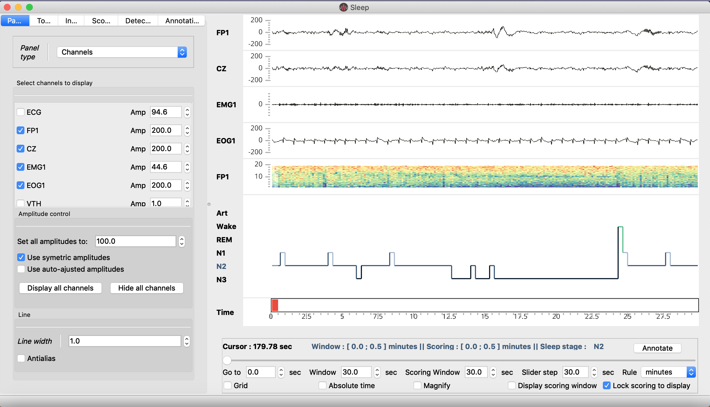
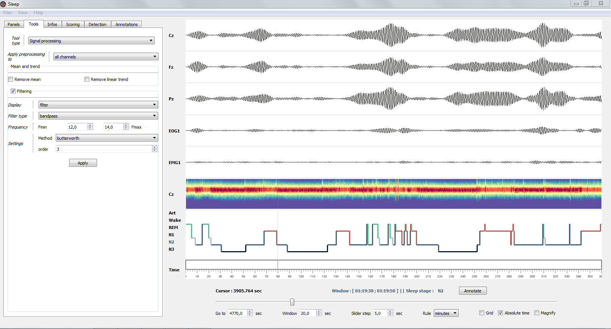
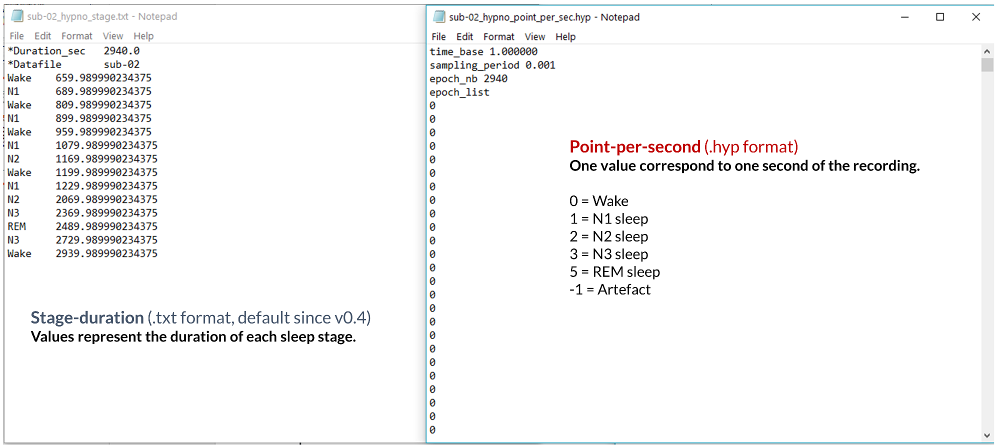
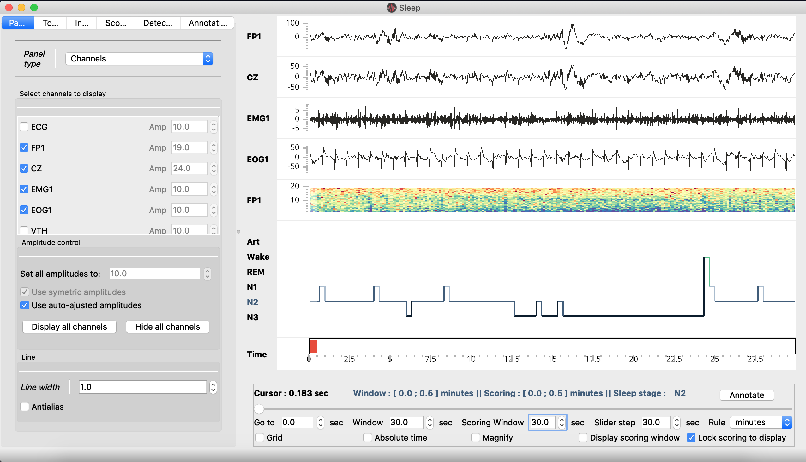
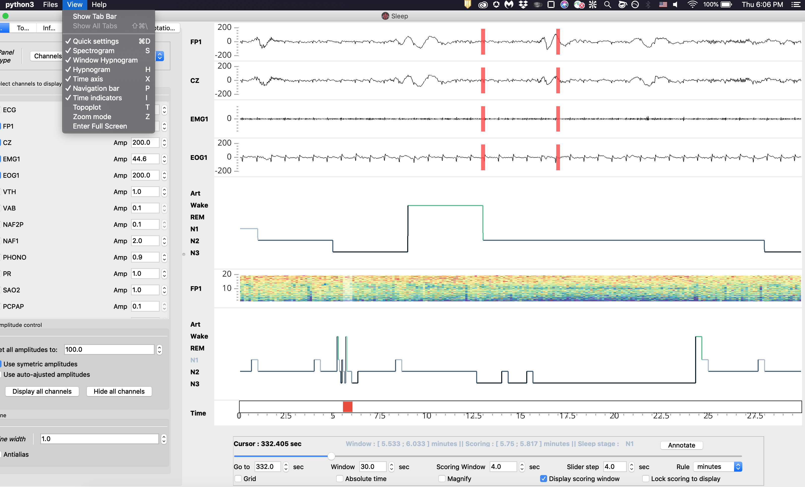
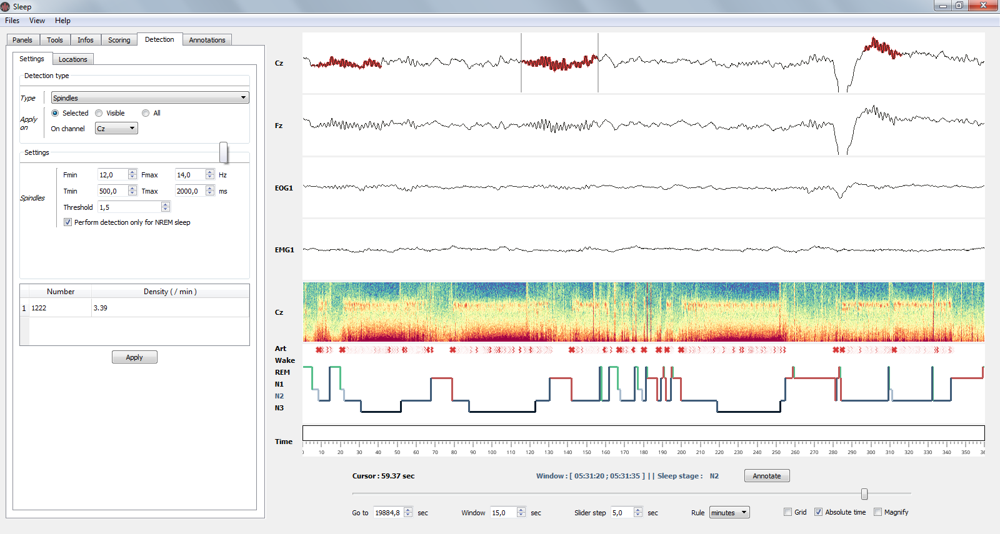
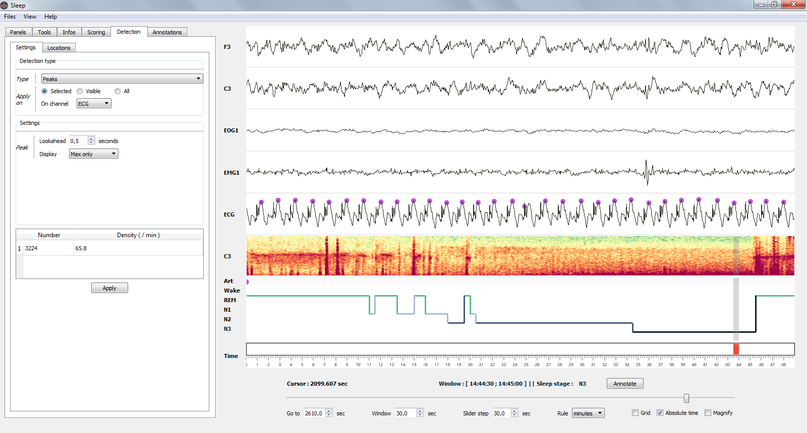
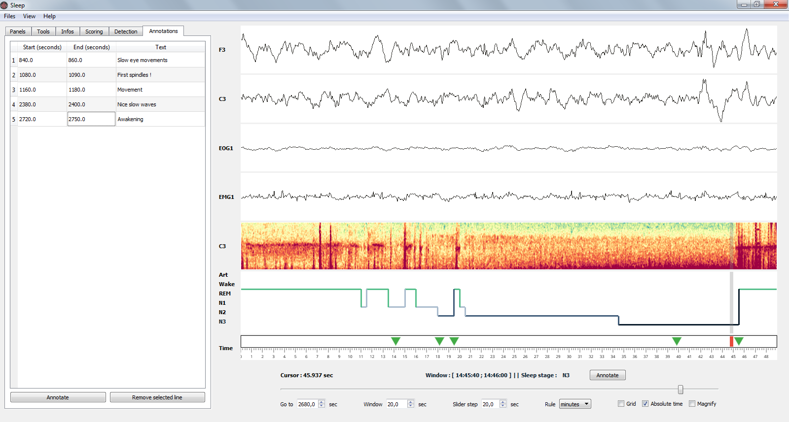

.. _SleepModule:

Sleep
=====

.. raw:: html

  

    <h1 class="display-3">Quick description </h1>
    
Sleep is a flexible graphical user interface for visualization, analysis and scoring of polysomnographic sleep data and is developed in collaboration with <a href="https://raphaelvallat.github.io/">Raphael Vallat</a> and <a href="http://bluebrain.epfl.ch/page-143249-en.html">Christian O Reilly</a>. If you use Sleep, please cite the article in <a href="http://journal.frontiersin.org/article/10.3389/fninf.2017.00060/full">Frontiers in Neuroinformatics</a>.

    

    

Checkout the API of the :class:`visbrain.gui.Sleep` class. If you need help with the :class:`Sleep` module, ask your questions in the dedicated `gitter Sleep chat <https://gitter.im/visbrain-python/Sleep?utm_source=share-link&utm_medium=link&utm_campaign=share-link>`_

.. contents:: Contents
   :local:
   :depth: 2

.. ##########################################################################
.. ##########################################################################
..                                 DESCRIPTION
.. ##########################################################################
.. ##########################################################################

Main features
~~~~~~~~~~~~~

.. raw:: html

    

        

            

              <b>Graphical User Interface (GUI)</b>
              <ul>
                <li>Modular and responsive GUI</li>
                <li>Take screenshot with controllable dpi</li>
                <li>Save the GUI state (channels, amplitude, panels, checkbox...)</li>
              </ul>
            

        

        

            

              <b>Load standard electro-physiological files</b>
              <ul>
                <li>Default supported files : European Data Format, BrainVision, Micromed, Elan</li>
                <li>Pass raw data or use MNE-python to load other <a href="https://martinos.org/mne/dev/manual/io.html#importing-eeg-data">file formats</a></li>
                <li>Supported extensions for hypnogram files : .txt, .csv, .xlsx, .hyp.</li>
              </ul>
            

        

        

            

              <b>Display</b>
              <ul>
                <li>Polysomnographic data (e.g. EEG, EOG, EMG)</li>
                <li>Time-frequency (=spectrogram)</li>
                <li>Hypnogram</li>
                <li>Topographic map</li>
              </ul>
            

        

        

            

              <b>Hypnogram</b>
              <ul>
                <li>Load, edit and save</li>
                <li>Real-time computation of sleep statistics</li>
                <li>Export high-quality hypnogram figure</li>
              </ul>
            

        

        

            

              <b>Signal processing</b>
              <ul>
                <li>De-meaning / de-trending</li>
                <li>Filtering</li>
                <li>Re-referencing to a reference channel or common average</li>
                <li>Bipolarization</li>
              </ul>
            

        

        

            

              <b>Semi-automatic events detections</b>
              <ul>
                <li>Spindles, K-complexes, slow waves, rapid eye movements, muscle twitches and peaks (each detection comes with additional and controllable parameters)</li>
                <li>Can be performed either on single or multiple channels</li>
                <li>Detections are reported on the hypnogram and inside a table</li>
              </ul>
            

        

    

Import and use sleep
~~~~~~~~~~~~~~~~~~~~

The :class:`Sleep` module can be imported as follow :

.. code-block:: python

    from visbrain.gui import Sleep
    # Run the interface (requires loading of a data file):
    Sleep().show()

GUI description
~~~~~~~~~~~~~~~

Components
^^^^^^^^^^

The :class:`Sleep` GUI is divided into 4 main parts:

.. figure::  _static/sleep/sleep_main_parts.png
   :align:   center

**Menu** :
The contextual menu allows to perform several functions such as the loading and saving of data files, hypnogram files, screenshots, GUI configuration.. It is also useful to control the visbility of each panel, display a list of shortcuts, or open the documentation.

**Main window** :
    * Polysomnographic data
    * Spectrogram (= time-frequency) of the whole recording
    * Whole recording hypnogram
    * Display window hypnogram (*hidden by default*)
    * Topoplot (*hidden by default*)

**Navigation bar** :
    * *Go to* : go to the time location of your choice
    * *[Display] Window* : length of the displayed time window
    * *Scoring window* : length of the scoring time window 
    * *Slider step* : step between each consecutive display windows
    * *Rule* : display unit in second, minute or hours
    * *Grid* : display the grid on the hypnogram and channel plot
    * *Magnify* : apply a zoom on the signal (e.g. useful to examine short events such as spindles). Alternatively, you can use CTRL + click at any time to zoom on a specific signal and time point.
    * *Display scoring window* : Hide or display vertical bars onto the data to indicate the limits of the current scoring window.
    * *Lock scoring to display* : When this option is selected (default), the scoring window is equal to the display window. When this option is off, the epoch used for scoring can be independent from the displayed epoch. See :ref:`hypnogram_scoring`..

**Settings panel** :
The setting panels is where most of the (advanced) functions of the software are! Among other things, you can control which channel to display, adjust the amplitudes, customize the spectrogram and hypnogram, compute the duration of each sleep stage, add annotations to the recording, and perform a bunch of semi-automatic detection (spindles, K-complexes...). See the section :ref:`sleep_settings_panel` for a description of each tab.

.. _sleep_settings_panel:

Settings panel tabs
^^^^^^^^^^^^^^^^^^^

There are five settings tabs :

* :ref:`paneltab` : manage channel, time-frequency, hypnogram and topographic map
* :ref:`toolstab` : signal processing tools (*e.g filtering, re-referencing*)
* :ref:`infotab` : sleep statistics and basic infos on the EEG recording
* :ref:`scoringtab` : a scoring table that can be used to edit the hypnogram
* :ref:`detectiontab` : automatic events detections
* :ref:`annotationtab` : manage annotations

.. _paneltab:

Panels
++++++

Manage channel, time-frequency, hypnogram and topographic map

.. figure::  _static/sleep/sleep_topo.png
   :align:   center

   The Settings panel: topoplot properties

* *Channels*
    * Show / hide channels :
        * Select the channels to display by clicking on the corresponding checkbox
        * Alternatively, you can click on display / hide all channels
    * Control the amplitude :
        * Per channel
        * By setting all amplitudes at once
        * Use symmetric amplitudes (-M, +M)
        * Use automatic amplitude (each amplitude fit to the (minimum, maximum) of the current displayed window)
* *Time-frequency*
    * Customize the spectrogram
        * Channel on which to compute the time-frequency
        * Computation method (see :ref:`time_frequency`)
        * Starting and ending frequencies
        * Time length window and overlap
        * Colormap
* *Hypnogram*
    * Customize the hypnogram
        * line width and line color
* *Topoplot*
    * Customize the topographic map (topoplot)
        * Show / hide topoplot
        * Display either the filtered signal, the amplitude or the power in specific frequency band
        * Colormap control

.. _toolstab:

Tools
+++++

Signal processing and re-referencing tools.

   Bandpass filter (12-14 Hz) applied on all channels.

* Signal processing (*apply in real time*)
    * Apply de-meaning and de-trending
    * filtering* and re-referencing which are applied directly on the signal and spectrogram (see image above)
* Re-referencing
    * Common average
    * Bipolarization (useful for intra-cranial EEG data)

.. _infotab:

Infos
+++++

The Infos panel displays the recording infos (e.g. name and downsampling frequency) as well as the main sleep statistics computed with the hypnogram (see specs below). These values are adjusted in real-time when you edit the hypnogram. Sleep statistics can be exported to **.csv** or **.txt** file.

.. figure::  _static/sleep/sleep_info.png
   :align:   center

   The Infos panel: sleep statistics and basic infos of the current recording.

* File properties
    * Filename
    * Sampling frequency
    * Down-sampling frequency
* Sleep statistics (*All values are expressed in minutes*):
    * Time in Bed (TIB) : total duration of the hypnogram
    * Total Dark Time (TDT) : duration of the hypnogram from beginning to last period of sleep
    * Sleep Period Time (SPT) : duration from first to last period of sleep
    * Wake After Sleep Onset (WASO) : duration of wake periods within SPT
    * Sleep Efficiency (SE) : TST / TDT * 100 (%)
    * Total Sleep Time (TST) : SPT - WASO
    * W, N1, N2, N3 and REM : sleep stages duration
    * Latencies : latencies of sleep stages from the beginning of the record

.. _scoringtab:

Scoring
+++++++

This tab contains the scoring table, i.e. where each stage start and finish. For further informations about how to score your hypnogram see :ref:`hypnogram_scoring`.

.. _detectiontab:

Detections
++++++++++

Perform semi-automatic detection of phasic events, such as sleep spindles, K-complexes, rapid eye movements...For a full tutorial see :ref:`apply_detection`.

.. _annotationtab:

Annotations
+++++++++++

Add and edit annotations (annotations are defined by a start and end point, as well as an optional text marker). To quickly add annotations:

* Use the *Annotate* button in the ruler to annotate the entire window
* Double click (with left mouse button) on a channel to add an annotation starting and finishing at the mouse cursor location.

If you want to import / export annotations, see the :ref:`import_annotation`

Shortcuts
^^^^^^^^^

Sleep comes with a bundle of shortcuts that can be used to speed up your productivity. If shortcuts do not work, simply left click on a canvas.

===================     =======================================================
Keys                    Description
===================     =======================================================
mouse wheel             Move the current window
double left click       Add annotation under mouse cursor
\-                      Decrease amplitude
\+                      Increase amplitude
a                       Score the current epoch as Artefact
w                       Score the current epoch as Wake
1                       Score the current epoch as N1
2                       Score the current epoch as N2
3                       Score the current epoch as N3
r                       Score the current epoch as REM
b                       Previous window
n                       Next window
s                       Display / hide spectrogram
t                       Display / hide topoplot
h                       Display / hide hypnogram
p                       Display / hide navigation bar
x                       Display / hide time axis
g                       Display / hide grid
z                       Enable / disable zoom
i                       Enable / disable indicators
CTRL + Num              Display / hide the channel Num [0, 9]
CTRL + left click       On a channel canvas, magnify signal under mouse location
CTRL + d                Display quick settings panel
CTRL + s                Save hypnogram
CTRL + n                Screenshot window
CTRL + e                Display documentation
CTRL + t                Display shortcuts window
CTRL + q                Close the window
===================     =======================================================

.. ##########################################################################
.. ##########################################################################
..                                 TUTORIAL
.. ##########################################################################
.. ##########################################################################

.. ----------------------------------------------------------------------------
..                              SUPPORTED FILES
.. ----------------------------------------------------------------------------

Supported files and format
~~~~~~~~~~~~~~~~~~~~~~~~~~

:class:`Sleep` natively supports several file formats for both electrophysiological and hypnogram data.

Data files
^^^^^^^^^^

Here’s the list of natively supported file formats:

* **.vhdr** (BrainVision version 1 and 2)
* **.edf** (European Data Format)
* **.trc** (Micromed version 4)
* **.eeg** (`ELAN <http://elan.lyon.inserm.fr>`_)

If MNE-python is installed, this list is extended to (see `also <https://martinos.org/mne/dev/manual/io.html#importing-eeg-data>`_) :

* **.bdf**
* **.gdf**
* **.egi**
* **.mff**
* **.set** (EEGLAB)
* **.cnt**
* **.vhdr** (*BrainVision files can be loaded using either the native library of Sleep or using MNE*)

Note that once MNE-python is installed, the loading of these file formats is transparent for users. It means that you can load these file formats directly using Sleep graphical user interface or command-line, without any additional steps. We therefore **strongly recommand** to `install MNE-python <https://martinos.org/mne/stable/index.html>`_.

If you have a file format that is currently not supported, :class:`Sleep` also provide the ability to directly pass raw data (NumPy array). Please click see this example of how to `to load a Matlab file <http://visbrain.org/auto_examples/sleep/load_matlab.html#sphx-glr-auto-examples-sleep-load-matlab-py>`_ and then pass the data directly to Sleep.

.. note::
  If you are having trouble with the loading of .edf files, we recommand installing `MNE-python <https://martinos.org/mne/stable/index.html>`_ and then loading your data using the following command::

    Sleep(data='mydata.edf', hypno='myhypno.csv', use_mne=True).show()

  This will force the loading of the .edf files using MNE, which can generally handle more cases and exceptions than the native EDF library implemented in :class:`Sleep`.

.. caution::
   By default, data are **automatically downsampled to 100 Hz** upon loading. If the sampling frequency of your recording is a power of two (e.g. 256, 512 Hz), we recommand to change the default downsampling value to 128 Hz using the following command::

    Sleep(data='mydata.edf', hypno='myhypno.csv', downsample=128).show()

Hypnogram
^^^^^^^^^

One of the main objective of Sleep is to **facilitate the sharing of data** across laboratories. This involves being able to accomodate for a variety of hypnogram format (unfortunately, there is no current gold standard on how to save hypnogram data). Here's the list of supported extensions for hypnogram files :

* **.txt**
* **.csv**
* **.xlsx**
* **.edf** (EDF+)
* **.hyp** (`ELAN <http://elan.lyon.inserm.fr>`_)

.. warning::
   Please note that Sleep uses the guidelines of *Iber et al. 2007* for sleep stage nomenclature (Wake, N1, N2, N3, REM and Artefact). If your hypnogram includes both NREM-S3 and NREM-S4 sleep stages you can add “N4” categories with the corresponding values in the description file. However, keep in mind that S3 and S4 will be merged into N3 during the import to the Sleep module. That also means that if you load and then save your hypnogram in Sleep, you will loose differentiation between S3 and S4 so be sure not to overwrite your original file!

Save hypnogram
^^^^^^^^^^^^^^

.. important::
  Since release v0.4, the default hypnogram export format uses stage duration rather than point-per-second encoding. This format avoids potential errors caused by downsampling and confusion in the values assigned to each sleep stage (which can drastically differ between two labs, e.g. N2 sleep can be encoded with the value 2 in one lab, and -2 in another lab). However, for retro-compatibility, we still allow user to save and load hypnogram in point-per-second format. Please see the image below to see the difference between stage-duration and point-per-second encoding.

By default, Sleep will save your hypnogram in .txt, using the stage-duration encoding:

==============          =================
Stage                    Duration
==============          =================
**Wake**                500
**N1**                  750
**N2**                  2000
**N3**                  3000
**N2**                  3200
...                     ...
**REM**                 30018
**Wake**                30100
==============          =================

**How to read the example above?**

The subject was awake from 0 to 500 seconds, then fell in N1 sleep between 500 to 750 seconds, then in N2 sleep between 750 to 2000 seconds, then in N3 sleep and so on. The subject was awakened in REM sleep, and the recording was stopped shortly after. The total duration of the recording (in seconds) corresponds to the last value of the hypnogram, in that case 30100 seconds.

The main advantages of using such an encoding format for the hypnogram is that it avoids any confusion related to the values used for each sleep stage, and drastically reduces the hypnogram file length without loosing any information. Please note that the software contains command-line functions to convert between point-per-second and stage-duration encoding.

.. tip::
  If you want to add any relevant informations / comments to the hypnogram, you can do so by adding lines preceded by an asterisk directly within the text file. Sleep will not read any line in the hypnogram that starts with an asterisk mark. For example, you can add the name of the scorer::

    *Scorer  John
    *Date    05_17_2018
    Wake     500
    N1       750

Elan .hyp format
++++++++++++++++

Alternatively, if you prefer point-per-second encoding, you can save your data in .hyp format, which can be read with any text editor. Sleep will create a single .hyp file with 4 header rows and the values presented above for the sleep stages, with the exception that the value assigned to REM sleep will be 5 for compatibility with Elan hypnogram reader.

.. important::
   If your hypnogram was created using another software, and is encoded in point-per-second, it is important that Sleep knows which value is associated with each sleep stage (e.g. 2 = N2 sleep, 4 = REM sleep). To do that, you need to create a simple text file in the same directory as the original hypnogram file,  named: *HYPNOFILENAME_description.txt*. Checkout this `example <https://drive.google.com/file/d/0B6vtJiCQZUBvYUFnQS1HWHhjSkE/view?usp=sharing>`_.

   **This text file should contain the following information :**

   ==========    ======  ======================================================
   Parameters    Values  Description
   ==========    ======  ======================================================
   Time          1       Hypnogram file contains one value per second
   Wake          0       The value assigned to Wake in the hypnogram is 0
   N1            1       The value assigned to N1 sleep in the hypnogram is 1
   N2            2       The value assigned to N2 sleep in the hypnogram is 2
   N3            3       The value assigned to N3 sleep in the hypnogram is 3
   REM           4       The value assigned to REM in the hypnogram is 4
   Artefact      \-1     The value assigned to Artefact in the hypnogram is \-1
   ==========    ======  ======================================================

.. ----------------------------------------------------------------------------
..                              LOAD FILES
.. ----------------------------------------------------------------------------

Load your files
~~~~~~~~~~~~~~~

There are four ways to load datasets into Sleep:

* :ref:`loadfromgui`
* :ref:`loadfrompath`
* :ref:`loadfromraw`
* :ref:`loadfrommne`

.. _loadfromgui:

Load file from the GUI
^^^^^^^^^^^^^^^^^^^^^^

Don't send anything, just open the interface and you will have a popup window asking for the filename of your data and hypnogram. If you do not have a hypnogram for your data and/or wish to display only the data, just press Cancel when the hypnogram popup opens.

.. code-block:: python

    # Import the Sleep module from visbrain :
    from visbrain.gui import Sleep
    # Run the interface :
    Sleep().show()

.. figure::  _static/sleep/sleep_open.png
   :align:   center

   Popup window for loading your files.

.. _loadfrompath:

Load file from path
^^^^^^^^^^^^^^^^^^^

Instead of leaving inputs arguments empty, send the path to the data :

.. code-block:: python

    # Import the Sleep module from visbrain :
    from visbrain.gui import Sleep
    # Define where the data are located :
    dfile = '/home/perso/myfile.eeg'
    # File for the hypogram :
    hfile = '/home/perso/hypno.hyp'
    # If you prefer to start with an empty hypnogram, just pass :
    # hfile = None
    Sleep(data=dfile, hypno=hfile).show()

.. _loadfrommne:

Load file using MNE-Python
^^^^^^^^^^^^^^^^^^^^^^^^^^

Finally, it is possible to load several other file formats using `MNE Python package <http://martinos.org/mne/stable/>`_. The code below shows how to load either BDF, EGI or EEGLab files and pass them to :class:`Sleep`.

.. code-block:: python

  # Import the Sleep module:
  from visbrain.gui import Sleep
  # - Biosemi Data Format (BDF)
  data = 'mybdffile.bdf'
  # - EGI format
  # data = 'myegifile.egi'
  # - EEGLab
  # data = 'myeeglabfile.set'
  # Now, pass all the data to the Sleep module :
  Sleep(data=data).show()

.. _loadfromraw:

Load file from raw data
^^^^^^^^^^^^^^^^^^^^^^^

It is possible to manually load raw data and pass them as inputs arguments Sleep. The code below show how to extract raw data from a Matlab .mat file (using SciPy):

.. code-block:: python

    from scipy.io import loadmat
    # Import the Sleep module from visbrain:
    from visbrain.gui import Sleep
    # Load your dataset :
    mat = loadmat('testing_database.mat')
    # Get the data, sampling frequency and channel names:
    raw_data, raw_sf, raw_channels = mat['data'], mat['sf'], mat['channels']
    # For the hypnogram :
    raw_hypno = mat['hypno']
    # As before, if you prefer to start from a fresh empty one, use:
    # raw_hypno = None or ignore passing this argument.
    # Now, pass all the arguments to the Sleep module:
    Sleep(data=raw_data, sf=raw_sf, channels=raw_channels,
          hypno=raw_hypno).show()

.. warning::
	Data must be an array with shape (channels, samples). The number of channels must be the same as in *channels* variable. If you load an hypnogram this way, it must have the same number of point (i.e same sampling rate) as the data. If your hypnogram comes with a different time base, the simplest way is to export it into a simple txt file and follow the procedure described above.

.. ----------------------------------------------------------------------------
..                              TIME-FREQUENCY
.. ----------------------------------------------------------------------------

.. _time_frequency:

Time-frequency
~~~~~~~~~~~~~~

There are currently three time-frequency methods implemented in Sleep.

=================   ===================================     ============================================
Name                Method                                  Dependency
=================   ===================================     ============================================
Fourier transform   Fourier-based spectrogram (default)     SciPy
Wavelet             Morlet's wavelet                        None
Multitaper          Multitaper-based Wigner spectrogram     `lspopt <https://github.com/hbldh/lspopt>`_
=================   ===================================     ============================================

.. figure::  _static/sleep/sleep_spectro_methods.png
   :align:   center

   Comparison of the 3 methods on a 50 minutes recording (C3 electrode, 0.5-20 Hz).

.. note::
   In most cases, the multitaper method is the one that gives the best results. To enable it, you must first install the `lspopt <https://github.com/hbldh/lspopt>`_ package.

.. ----------------------------------------------------------------------------
..                              SCORING
.. ----------------------------------------------------------------------------

.. _hypnogram_scoring:

Hypnogram scoring
~~~~~~~~~~~~~~~~~

Sleep offers two possibilities to score the hypnogram: using shortcuts or using the :ref:`scoretable`.

.. _scoretable:

Scoring table
^^^^^^^^^^^^^

The Scoring panel can be used to manually edit the hypnogram values. It contains three columns:

* **From** : specify where the stage start (*in minutes*)
* **To** : specify where the stage finish (*in minutes*)
* **Stage** : the stage type (use Art, Wake, N1, N2, N3 or REM. Can be lowercase)

At the end of the hypnogram, you can **Add line** or **Remove line** when a line is selected. An other interesting option is that the table is sortable (by clicking on the arrow inside the column name).

.. note::
    You can export either the raw hypnogram values, the hypnogram scoring table, or a high-quality figure of the hypnogram using the  *Files > Save* contextual menu.

.. _navigation:

Navigation
^^^^^^^^^^

This is probably the most useful editing method, as it allows scoring while scrolling through your data. 

To insert a sleep stage, use the keys below :

==============          =================
Keys                    Description
==============          =================
a                       Artefact
w                       Wake stage
1                       N1 stage
2                       N2 stage
3                       N3 stage
r                       REM stage
==============          =================

After pressing one of those keys, the software will score accordingly the current "Scoring window", and scroll through to the next epoch so that you can continue scoring.

The software supports two modes of scoring, to allow scoring of both human or animal data:

* **In "locked" mode (option "Lock scoring to display" checked), the "scoring
window" is always equal to the display window**, and pressing a key will score
the whole displayed epoch. By default in this mode, the slider step is equal
to the duration of the displayed epoch. This mode is useful for scoring human datasets.

* **In "unlocked" mode (option "Lock scoring to display" unchecked), the "scoring
window" is independent from the display window**, letting the user score short
epochs while visualizing the data around the scored epochs. The limits of the
scoring window are indicated by vertical bars on the channel plots (which can be
hidden by toggling the "Display scoring window" option). By displaying the
"Window Hypnogram" (in the menu options), the user can also see the hypnogram
stages within the whole displayed epoch, and thus around the scored epoch. This is
typically useful for scoring animal datasets. By default in this mode, the
slider step is equal to the duration of the scoring window. The software will
switch automatically to the "unlocked" mode when explicitly changing the scoring
window size. 

.. warning::
   If no canvas are selected the shortcuts might not work. Simply click on a canvas (on a channel / spectrogram / hypnogram) before starting to score to avoid this issue.

   Score the whole displayed epoch

   Score the epoch within the centered "scoring window"

.. ----------------------------------------------------------------------------
..                              DETECTIONS
.. ----------------------------------------------------------------------------

.. _apply_detection:

Apply semi-automatic detection
~~~~~~~~~~~~~~~~~~~~~~~~~~~~~~

The Detection panel offers several semi-automatic algorithms for the detection of sleep features such as sleep spindles, K-complexes, rapid eyes movements, slow waves, muscle twitches and peaks. All detection types shared the following parameters :

* *Apply on* : choose on which channel to perform the detection

  * Selected : apply detection on selected channel
  * Visible : apply detection on all visible channels
  * All : apply detection on all channels (even those that are hidden)

.. note::
   After performing one of the detection, go to the *Location* tab to see infos about each detected events (starting and ending points, duration, sleep stage). Select the event to jump to it. Finally, you can export the location table using the File > Save contextual menu.

Two examples of automatic event detection are shown below.

Spindles detection
^^^^^^^^^^^^^^^^^^
This algorithm perform a semi-automatic detection of sleep spindles which are an essential feature of N2 sleep. Sleep spindles are defined as bursts of 12-14 Hz waves that occur for at least 0.5 seconds. They are maximally visible on central electrodes.

   Spindles detection on channel Cz.

.. note::

   * **Parameters**
       * *Fmin* : Highpass frequency, default 12 Hz
       * *Fmax* : Lowpass frequency, default 14 Hz
       * *Tmin* : Minimum duration, default 0.5 second
       * *Tmax* : Maximum duration, default 2 seconds
       * *Threshold* : defined as Mean + X * standard deviation of the signal. A  higher threshold will results in a more conservative detection.
       * *Perform detection only for NREM sleep* : if True and a hypnogram is loaded, then the detection will only be performed on NREM sleep epochs.

Peaks detection
^^^^^^^^^^^^^^^

Perform a peak detection.

   Peaks detection on ECG channel.

.. note::

   * **Parameters**
       * *Lookahead* : minimum distance between two peaks.
       * *Display* : display either maximum / minimum / maximum & minimum

.. important::
  Please note that the software does not yet allow to automatically score sleep stages. However, if you are interested to collaborate and / or implement your own algorithm, please feel free to contact us.

.. _replace_detection:

Use your own detections in Sleep
~~~~~~~~~~~~~~~~~~~~~~~~~~~~~~~~

*Sleep* offers the possibility to replace the native detection algorithms with your own detection algorithms. To do it, you have to provide a function with predefined inputs and outputs.

Prototype of the function
^^^^^^^^^^^^^^^^^^^^^^^^^

Here's a prototype of a function to replace *Sleep* spindle detections :

.. code-block:: python

  def my_custom_spindle_detection(data, sf, time, hypno):
      """Use your own spindle detection

      Parameters
      ----------
      data : np.ndarray
          Data of one unique channel (i.e shape (n_time_pts,))
      sf : float
           The sampling frequency (512., 1024. etc.)
      time : np.ndarray
          The time vector (i.e shape (n_time_pts,))
      hypno : np.ndarray
          The hypnogram (i.e shape (n_time_pts,))

      Returns
      -------
      indexes : np.ndarray
          indexes of detected events.
      """
      pass

Function output
^^^^^^^^^^^^^^^

For your convenience, *Sleep* accepts several possible output formats for your custom detection :

* **(Start, Stop)** : an array of shape *(n_dected_events, 2)* where *2* describes the index where each event start and finish.
* **Boolean vector** : a boolean vector of shape *(n_time_pts,)* where each *True* value refers to a time point that belong to a detected event.
* **Consecutive indexes** : an array which only contains consecutive indexes of detected events.

It means that your function will work as long as you are able to return any one of these three possible vectors. Since it is very likely that your home-made detection function already return one of those, implementing it in *Sleep* should be fairly easy! A graphical representation of these output formats is displayed below:

.. figure::  _static/sleep/sleep_return_indices.png
   :align:   center

   Supported output format of the custom detection algorithm.

Replace Sleep detection
^^^^^^^^^^^^^^^^^^^^^^^

Once your function has proper inputs and outputs, simply use the :class:`visbrain.gui.Sleep.replace_detections` method to replace the detection of *Sleep* with your own. Please visit the Examples section to see some concrete examples.

.. ----------------------------------------------------------------------------
..                              GUI CONFIG
.. ----------------------------------------------------------------------------

Load and save the GUI configuration
~~~~~~~~~~~~~~~~~~~~~~~~~~~~~~~~~~~

From the *Files > Save* contextual menu, you can save the GUI configuration. This will save the state of all buttons and properties inside :class:`Sleep`. Then, you can recharge the GUI configuration using *Files > Load > GUI config*.
Alternatively, if you want to use a configuration when running :class:`Sleep`, you can use the *config_file* argument to directly pass the path to a configuration file. Note that configuration file are encoded in JSON format, which can be easily read and modified using any text editor.

.. code-block:: python

  from mne import io
  # Import the Sleep module:
  from visbrain.gui import Sleep

  Sleep(config_file='pathto/myconfig.json')

.. ----------------------------------------------------------------------------
..                              ANNOTATIONS
.. ----------------------------------------------------------------------------

.. _import_annotation:

Import, add and save annotations
~~~~~~~~~~~~~~~~~~~~~~~~~~~~~~~~

:class:`Sleep` provides a table for annotations. In this table, specify where the event start, finish and the associated text. Selecting a row of this table center the window around the selected time-code. This allow to quickly navigate even in large files.

   Annotations in Sleep. All annotations are referenced in a table in the quick settings panel (left). Each annotation is then reported in the time axis as a green triangle.

Import annotations
^^^^^^^^^^^^^^^^^^

If the interface is opened, load annotations from the menu *Files > Load > Annotations*. Otherwise, you can use the input variable *annotations* to set the path to an existing annotation file that need to be loaded. There is several ways to define annotations :

* :ref:`annotations_txt`
* :ref:`annotations_mne`
* :ref:`annotations_mark`

.. _annotations_txt:

Annotations in a text file
++++++++++++++++++++++++++

Annotations can be defined in a `csv file <https://drive.google.com/file/d/0B6vtJiCQZUBvSXpmS0FGZ1E4M1U/view?usp=sharing>`_ or in a `txt file <https://drive.google.com/file/d/0B6vtJiCQZUBvOENtTks1Z3NLam8/view?usp=sharing>`_ file.

.. code-block:: python

  from mne import io
  # Import the Sleep module:
  from visbrain.gui import Sleep

  Sleep(annotations='pathto/myannotations.txt')

.. _annotations_mne:

Using MNE-Python annotations
++++++++++++++++++++++++++++

Alternatively, you can use annotations from MNE-python and pass your annotations to the *annotations* variable :

.. code-block:: python

  import numpy as np
  from mne import Annotations
  from visbrain.gui import Sleep

  # Define the onset, duration and description :
  onset = np.array([117., 256., 312.])
  durations = np.array([5, 10, 4])
  description = np.array(['First event', 'Second event', 'Third event'])
  annot = Annotations(onset, durations, description)

  Sleep(annotations=annot)

.. _annotations_mark:

Define only markers
+++++++++++++++++++

Annotations can be seen as the combination of a time-code and a label. If you don't need a label to your event, you can only specify the time-code in seconds:

.. code-block:: python

  import numpy as np
  from visbrain.gui import Sleep

  # Define the onset :
  onset = np.array([117., 256., 312.])

  Sleep(annotations=onset)

Add new annotations
^^^^^^^^^^^^^^^^^^^

To add new annotations :

* From the ruler or from the **Annotations** tab of the quick settings panel, use the **Annotate** button to annotate the currently displayed window
* Double clicking on a canvas is an other way to quickly add annotations.

Save annotations
^^^^^^^^^^^^^^^^

The list of annotations can be exported (either in .txt or .csv) or loaded from the *Files* contextual menu.

Examples
~~~~~~~~

.. include:: generated/visbrain.gui.Sleep.examples

.. raw:: html

    

