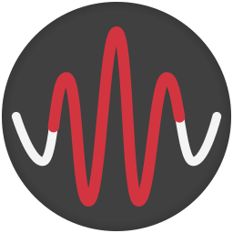
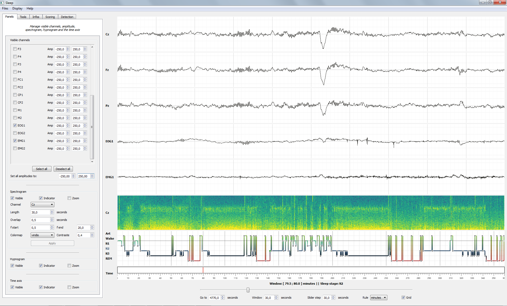
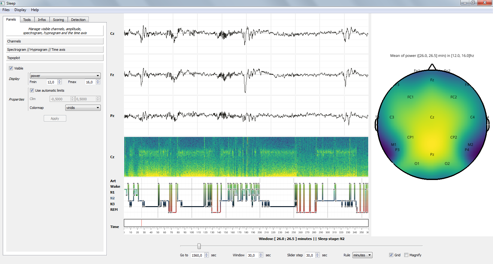
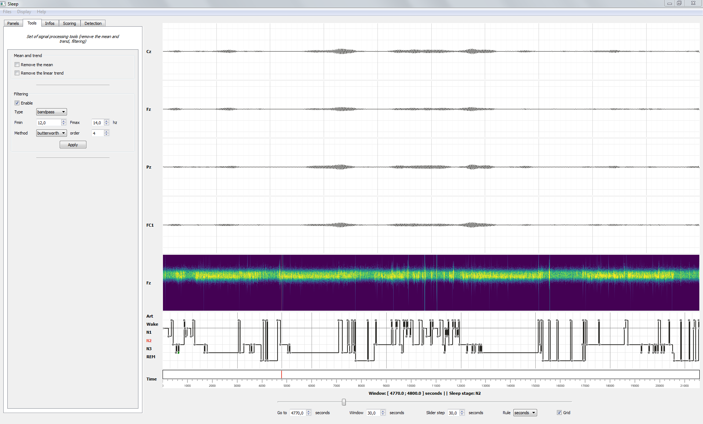
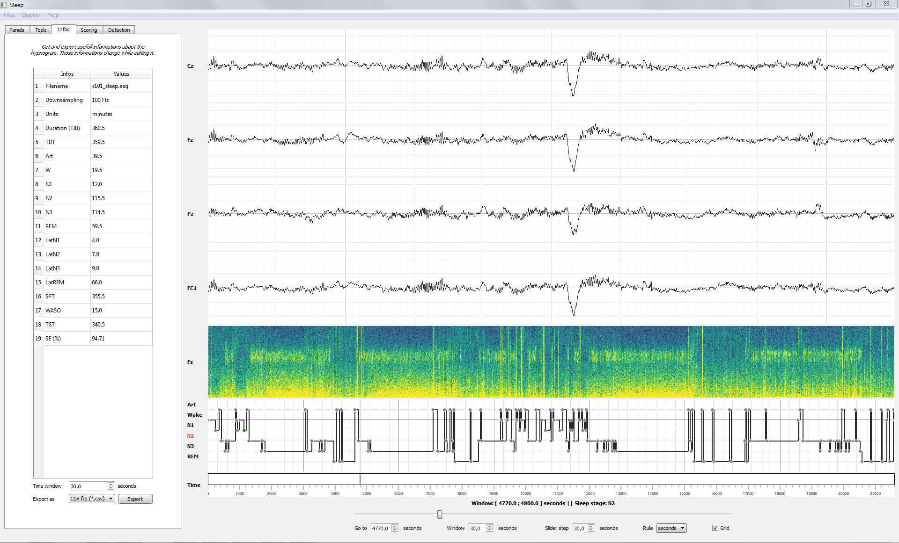
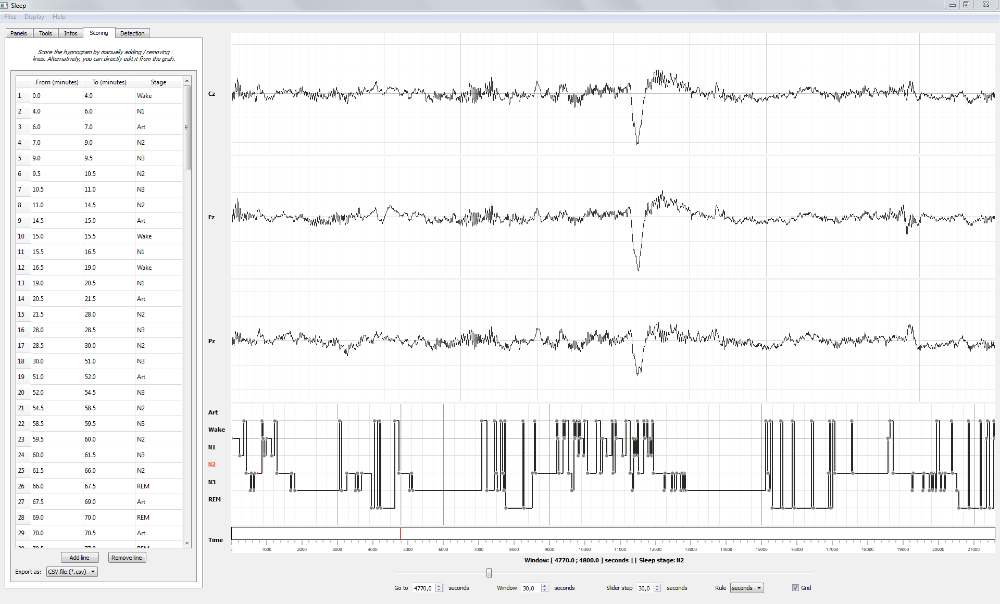
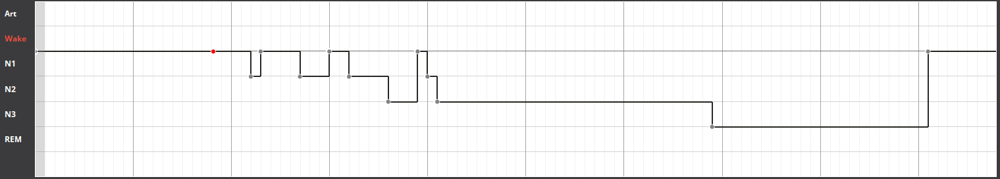
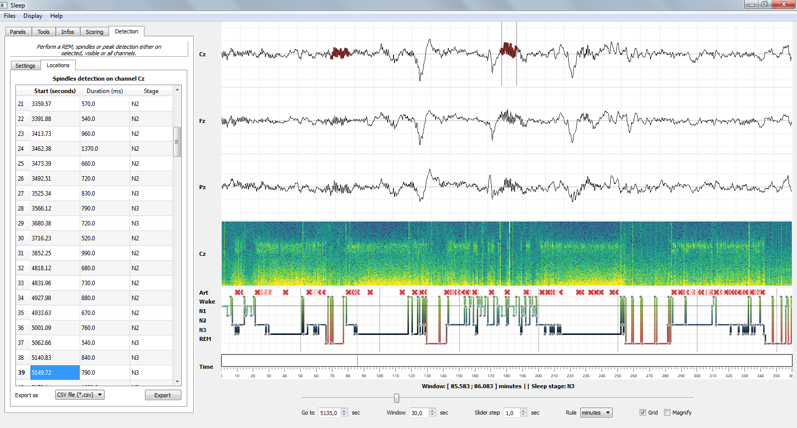
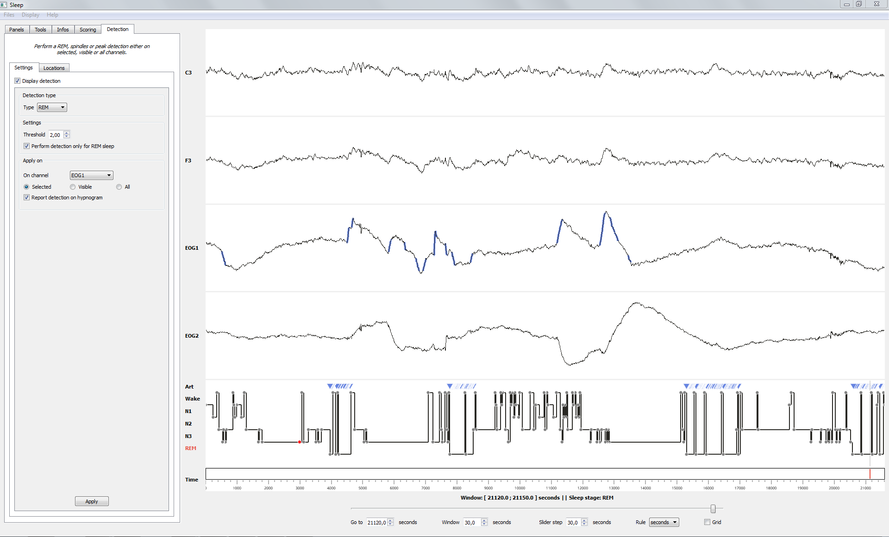

.. _Sleep:

Sleep
=====

Description
-----------

   The Sleep module: individual control of each channel.

Sleep is a graphical user interface dedicated to visualization and scoring of sleep data. Sleep runs on Vispy excellent package and benefits thus from the high-performance of this latter (GPU-based computation). Some of the most relevant features of Sleep include:

* Dynamic display of polysomnographic data, spectrogram, hypnogram and topoplot, with individual real-time adjustment of channel amplitude and visibility.
* Spectrogram display with several controllable parameters (e.g. frequency, channel, colormap)
* Hypnogram editing and saving functions, as well as real-time computation of the main sleep parameters (see Hypnogram section).
* Implementation of several semi-automatic detection method such as sleep spindles, K-complexes, slow waves, rapid eye movements, muscle twitches or peak detection. These can be performed either on single or multiple channels and report where each one of them on the hypnogram or inside a table. Each detection comes with several parameters that the user can adjust to find the optimal detection.
* Several others signal processing tools such as de-mean, de-trend and filtering. Those tools are directly applied to each channel and to the spectrogram
* Nice and intuitive interface to help you scroll and explore your data.

Import and use sleep
--------------------

The Sleep module can be imported as follow :

.. code-block:: python

    from visbrain import Sleep

Examples and datasets
---------------------
To try out in the absence of sleep data, please check out some example scripts and datasets on `Google drive <https://drive.google.com/drive/folders/0B6vtJiCQZUBvRjc3cFFYcmFIeW8?usp=sharing>`_

Supported files and format
--------------------------

Sleep support by default several data format for both electrophysiological and hypnogram data.

Data files
~~~~~~~~~~

Here’s the list of currently supported extensions for data files:

* BrainVision (**.eeg**) version 1 and 2
* Micromed (**.trc**) version 4
* European Data Format (**.edf**)
* `ELAN <http://elan.lyon.inserm.fr>`_ (**.eeg**)

.. note::
   Extensions above are the ones natively supported inside Sleep, but you can also directly pass numpy array or .mat file (loaded with scipy.loadmat)

.. warning::
   Sleep applies an automatic downsampling to 100 Hz upon loading. You can change this value with the “downsample” argument of Sleep (command-line only) or directly in the file sleep.py.

Hypnogram
~~~~~~~~~

Here's the list of supported extensions for hypnogram files :

* **.txt**
* **.csv**
* **.hyp** (`ELAN <http://elan.lyon.inserm.fr>`_)

.. warning::
   There is no international gold standard for the hypnogram format yet and each lab can have its own format. To overcome problems caused by different sampling rate of hypnogram files and/or different values assigned to each sleep stages, Sleep requires that you specify these parameters in a .txt file. This text file should be in the same directory as the original hypnogram file and be named: *HYPNOFILENAME_description.txt*. Checkout this `example <https://github.com/EtienneCmb/visbrain/tree/master/docs/Hypnogram_excerpt2_description.txt>`_.

   **This text file should contain the following information :**

   * *Time* : the number of seconds represented by one value of the hypnogram (e.g. one value per 30 second, time = 30, one value per second, time = 1).
   * *W, N1, N2, N3, REM, Art* : The value in your hypnogram that corresponds to stage Wakefulness, N1, N2, N3, REM and Art.

   Please note that Sleep uses the guidelines of *Iber et al. 2007* for sleep stage nomenclature, i.e. Wake, N1, N2, N3, REM and Artefact. If your hypnogram includes both NREM-S3 and NREM-S4 sleep stages you can add “N4” categories with the corresponding values in the description file. However, keep in mind that S3 and S4 will be merged into N3 during the import to the Sleep module. That also means that if you load and then save your hypnogram in Sleep, you will loose differenciation between S3 and S4 so be sure not to overwrite your original file!

Save hypnogram
~~~~~~~~~~~~~~

By default, Sleep will save your hypnogram with a sampling rate of 1 value per second, and with the following values assigned to each sleep stages:

==============          =================
Stage                    Value
==============          =================
**Wake**                 0
**N1**                   1
**N2**                   2
**N3**                   3
**REM**                  4
**Art**                  \-1  (optional)
==============          =================

Elan .hyp format
^^^^^^^^^^^^^^^^

Sleep will create a single .hyp file with 4 header rows and the values presented above for the sleep stages, with the exception that the value assigned to REM sleep will be 5 for compatibility with Elan hypnogram reader.

.txt format
^^^^^^^^^^^^^^^^^^

Sleep will automatically create a HYPNOFILENAME_description.txt with the appropriate parameters (time, sleep stages values), therefore making it easy to reload it later.

Load your files
---------------

There is three way for loading your files :

* :ref:`loadfromgui`
* :ref:`loadfrompath`
* :ref:`loadfromraw`

.. _loadfromgui:

From the GUI
~~~~~~~~~~~~

Don't send anything, just open the interface and you will have a popup window asking for the filename of your data and hypnogram. If you do not have a hypnogram for your data and/or wish to display only the data, just press Cancel when the hypnogram popup opens.

.. code-block:: python

    # Import the Sleep module from visbrain :
    from visbrain import Sleep
    # Run the interface :
    Sleep().show()

.. figure::  picture/Sleep_open.png
   :align:   center

   Popup window for loading your files.

.. _loadfrompath:

From path
~~~~~~~~~

Instead of leaving inputs arguments empty, send the path to the data :

.. code-block:: python

    # Import the Sleep module from visbrain :
    from visbrain import Sleep
    # Define where the data are located :
    dfile = '/home/perso/myfile.eeg'
    # File for the hypogram :
    hfile = '/home/perso/hypno.hyp'
    # You're not forced to give a hypnogram. If you prefer to start from a fresh empty one, use :
    # hfile = None or ignore passing this argument.
    Sleep(file=dfile, hypno_file=hfile).show()

.. _loadfromraw:

Raw data
~~~~~~~~

This third way is the manually one. You have to load your data before and sending it to the sleep module. For example if you want to import Matlab .mat file:

.. code-block:: python

	from scipy.io import loadmat
    # Import the Sleep module from visbrain :
    from visbrain import Sleep
    # Load your dataset :
    mat = loadmat('testing_database.mat')
    # Get the data, sampling frequency and channel names :
    raw_data = mat['data']
    raw_sf = mat['sf']
    raw_channels = mat['channels']
    # For the hypnogram :
    raw_hypno = mat['hypno']
    # As before, if you prefer to start from a fresh empty one, use :
    # raw_hypno = None or ignore passing this argument.
    # Now, pass all the arguments to the Sleep module :
    Sleep(data=raw_data, sf=raw_sf, channels=raw_channels,
          hypno=raw_hypno).show()

.. warning::
	Data must be an array with shape (channels, samples). The number of channels must be the same as in *channels* variable. If you load an hypnogram this way, it must have the same number of point (i.e same sampling rate) as the data. If your hypnogram comes with a different time base, the simplest way is to export it into a simple txt file and follow the procedure described above.

Tabs descripion
---------------

Sleep provide five settings tabs :

* :ref:`paneltab` : manage object visibility, channel's amplitudes, spectrogram properties...
* :ref:`toolstab` : a bundle of signal processing tools (like *filtering*)
* :ref:`infotab` : Sleep statistics and record basic infos
* :ref:`scoringtab` : a scoring table that can be used to edit the hypnogram
* :ref:`detectiontab` : Automatic detection of sleep spindles, rapid eye movements (REMs), slow waves, K-complexes (KCs) and peaks

In addition, there is a ruler (bottom of the page). From this ruler :

* *Go to* : go to the time location of your choice
* *Window* : length of the displayed time window
* *Slider step* : step between each consecutive window
* *Rule* : display unit in second, minute or hours
* *Grid* : display the grid on the hypnogram and channel plot
* *Magnify* : improve plot lisibility (better for small time events). Alternatively, click on the plot of your choice for increasing lisibility directly.

.. _paneltab:

Panels
~~~~~~

From the **Panels** tab control displayed elements/

Channels
^^^^^^^^

* Show / hide channels :

  *  Select channels of your choice by clicking on the corresponding checkbox
  * Display / hide all channels

* Control the amplitude :

  * Per channel
  * By setting all amplitudes at once
  * Use symetric amplitudes (-M, +M)
  * Use automatic amplitude (each amplitude fit to the (minimum, maximum) of the current displayed window)

Spectrogram // hypnogram // time axis
^^^^^^^^^^^^^^^^^^^^^^^^^^^^^^^^^^^^^

* Control spectrogram looking and properties

  * the channel on whichs compute spectrogram
  * tarting and ending frequencies
  * time length window and overlap
  * colormap

* Show / hide spectrogram, hypnogram, time axis
* Display / hide visual indicators refering to the current time window
* Zoom : when zooming, the axis will fit to the time window according to the (window, step) parameters defined in the ruler

Topoplot
^^^^^^^^

* Show / hide topoplot
* Display several information types :

  * The raw signal
  * The filtered signal
  * The amplitude
  * The power

Filtered, amplitude and power are computed in a specific frequency band. The topoplot display the mean across the current time window according to the (window, step) parameters defined in the ruler.

.. _toolstab:

Tools
~~~~~

The Tools panel offers several signal processing tools such as *de-meaning*, *de-trending*, *filtering* and re-referencing which are applied directly on the signal and spectrogram (see image below).

Filtering
^^^^^^^^^

Apply either a lowpass, highpass or bandpass butterworth filter on the channel data and spectrogram.

   Bandpass filter applied across all channels and spectrogram.

Referencing
^^^^^^^^^^^

Sleep allows you to re-reference your dataset either to a specified channel or using bipolarization. Note that this could be applied only once.

.. _infotab:

Info
~~~~

The Info panel displays recording information (name and downsampling frequency) as well as the main sleep statistics computed with the hypnogram (see specs below). These values are adjusted in real-time if you modify the hypnogram using either live edition or the Scoring panel. Sleep statistics can be exported to **.csv** or **.txt** file.

   Hypnogram's informations.

Sleep statistics specifications (*All values are expressed in minutes*):

* *Time in Bed (TIB)* : total duration of the hypnogram.
* *Total Dark Time (TDT)* : duration of the hypnogram from beginning to last period of sleep.
* *Sleep Period Time (SPT)* : duration from first to last period of sleep.
* *Wake After Sleep Onset (WASO)* : duration of wake periods within SPT
* *Sleep Efficiency (SE)* : TST / TDT * 100 (%).
* *Total Sleep Time (TST)* : SPT - WASO.
* *W, N1, N2, N3 and REM* : sleep stages duration.
* *Latencies* : latencies of sleep stages from the beginning of the record.

.. _scoringtab:

Scoring
~~~~~~~

Sleep offers three possibilities to score the hypnogram, during the :ref:`navigation` using shortcuts, manually using the :ref:`scoretable` or in :ref:`liveedit`.

   Hypnogram scoring table.

.. _navigation:

Navigation
^^^^^^^^^^

This is probably the most usefull editing method. While you are navigating across time, simply press on your keyboard to insert a sleep stage. Use the key below :

==============          =================
Keys                    Description
==============          =================
a                       Artefact
w                       Wake stage
1                       N1 stage
2                       N2 stage
3                       N3 stage
r                       REM stage
==============          =================

After pressing one of those keys, data coming from the next window will be prompted automatically so that you can continue scoring.

.. warning::
   If no canvas are selected the shortcuts might be not working. Simply click on a canvas (on a channel / spectrogram / histogam) before starting to score to avoid this issue.

.. _scoretable:

Scoring table
^^^^^^^^^^^^^

The Scoring panel can be used to manually edit the hypnogram values. It contains three columns :

* **From** : specify where the stage start (*in minutes*)
* **To** : specify where the stage finish (*in minutes*)
* **Stage** : the stage type (use Art, Wake, N1, N2, N3 or REM. Can be lowercase)

At the end of the hypnogram, you can **Add line** or **Remove line** when a line is selected. An other interesting option is that the table is sortable (by clicking on the arrow inside the column name).

Then, you can export your hypnogram in **.hyp**, **.txt** or **cvs**.

.. figure::  picture/Scoring_table.png
   :align:   center

   Hypnogram scoring using the Scoring table. Manually specify where each stage start / finish and precise the stage type.

.. _liveedit:

Live editing
^^^^^^^^^^^^

Live editing consist of editing your hypnogram directly from the axis by adding / selecting / dragging points. Unused points will be automatically destroyed.

  - Your cursor is red. Existing points are set in gray.
  - Double click on the hypnogram to add points
  - Hover an existing point in order to select it (the point turn green)
  - Dragg the point (blue) on the diffrent hypnogram values

   Edit the hypnogram directly from the axes.

.. _detectiontab:

Detection
~~~~~~~~~

The Detection panel offers several semi-automatic algorithms for the detection of sleep features such as sleep spindles, K-complexes, rapid eyes movements, slow waves, muscle twitches and peaks. All detection types shared the following parameters :

* *Apply on* : choose on which channel to perform the detection

  * Selected : apply detection on selected channel
  * Visible : apply detection on all visible channels
  * All : apply detection on all channels (even those that are hidden)
* *Report detection on hypnogram* : display markers on the hypnogram where your spindles / REM / peaks are located.

.. note::
   After performing one of the detection, got to the *Location* tab to see where detected events start, the duration and on which sleep stage they are located. Select the event to jump to it. Finally, you can export all located event.

Spindles detection
^^^^^^^^^^^^^^^^^^
This algorithm perform a semi-automatic detection of sleep spindles which are an essential feature of N2 sleep. Sleep spindles are defined as bursts of 12-14 Hz waves that occur for at least 0.5 seconds. They are maximally visible on central electrodes.

   Spindles detection on channel Cz and report on the hypnogram.

**Parameters** :

* *Fmin* : Highpass frequency, default 12 Hz
* *Fmax* : Lowpass frequency, default 14 Hz
* *Tmin* : Minimum duration, default 0.5 second
* *Tmax* : Maximum duration, default 2 seconds
* *Threshold* : defined as Mean + X * standard deviation of the signal. A higher threshold will results in a more conservative detection.
* *Perform detection only for NREM sleep* : if this checkbox is checked and a hypnogram is loaded, the algorithm will only take into account epochs scored as NREM sleep. This allows for a more precise and sensitive detection.

Rapid Eye Movements detection
^^^^^^^^^^^^^^^^^^^^^^^^^^^^^

This algorithm perform a semi-automatic detection of rapid eye movements (REMs, or saccades) which occur during REM sleep (hence the name). Briefly, the method identify consecutive supra-threshold samples of the first derivative of the signal (after filtering).

   Rapid Eye Movements (REM) detection on channel EOG1 and report on the hypnogram.

**Parameters** :

* *Perform detection only for REM sleep* : once again, if a hypnogram is loaded, you can choose whether you want to perform the detection only for REM sleep epochs or for the whole recording.
* *Threshold* : defined as Mean + X * standard deviation of the signal. A higher threshold will results in a more conservative detection.

Peaks detection
^^^^^^^^^^^^^^^

Perform a peak detection.

.. figure::  picture/Sleep_peak.png
   :align:   center

   Peaks detection on ECG channel and report on the hypnogram.

**Parameters** :

* *Lookahead* : minimum distance between two peaks.
* *Display* : display either maximum / minimum / maximum & minimum

Shortcuts
---------

Sleep comes with a bundle of shortcuts that can be used to speed up your productivity. If shortcuts don't seems to be active, simply click on a canvas before.

==============          ==================================================================================
Keys                    Description
==============          ==================================================================================
mouse wheel             Move the current window
mouse click             On a channel canvas, magnify signal under mouse location
\-                      Decrease amplitude
\+                      Increase amplitude
a                       Insert Artefact in the hypnogram
w                       Insert Wake stage in the hypnogram
1                       Insert N1 stage in the hypnogram
2                       Insert N2 stage in the hypnogram
3                       Insert N3 stage in the hypnogram
r                       Insert REM stage in the hypnogram
b                       Previous window
n                       Next window
s                       Display / hide spectrogram
t                       Display / hide topoplot
h                       Display / hide hypnogram
p                       Display / hide navigation bar
z                       Enable / disable zoom
CTRL + d                Display quick settings panel
CTRL + s                Save hypnogram
CTRL + n                Screenshot window
CTRL + e                Display documentation
CTRL + t                Display shortcuts window
CTRL + q                Close the window
==============          ==================================================================================

Collaborator
------------

Sleep is developped in collaboration with `Raphael Vallat <https://raphaelvallat.github.io/>`_.
