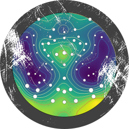
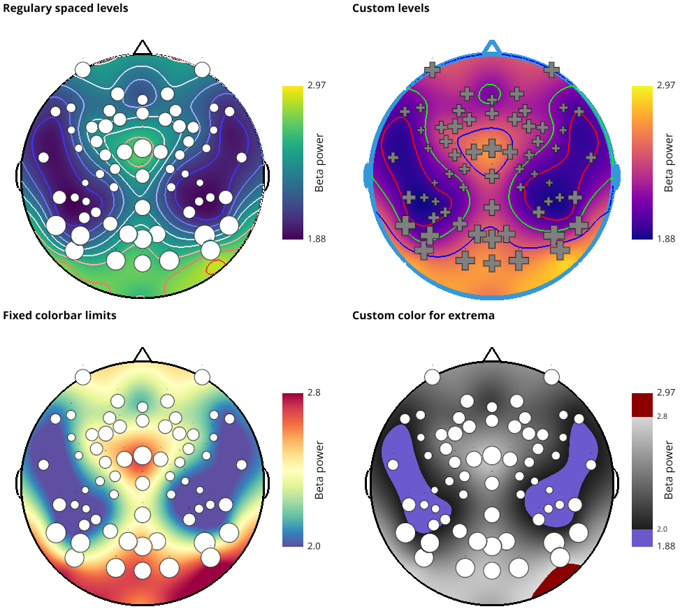

.. _Topo:

Topo
====

Description
-----------

*Topo* is a GUI based module for topographic representations.

Help
~~~~

If you need help with the *Topo* module, ask your questions in the dedicated `gitter Topo chat <https://gitter.im/visbrain-python/Topo?utm_source=share-link&utm_medium=link&utm_campaign=share-link>`_

Main features
~~~~~~~~~~~~~

* **Display topographic map**
    * Find coordinates according to channel names
    * Support multiple coordinate systems
    * Highly controllable colorbar
* **Grid representation**
    * Display topoplot into a highly controllable grid.
    * Add either one colorbar per topoplot or one shared colorbar across topoplot

Import and use Topo
~~~~~~~~~~~~~~~~~~~

The *Topo* module can be imported as follow :

.. code-block:: python

    from visbrain import Topo

Examples and datasets
~~~~~~~~~~~~~~~~~~~~~

Visit this page for a set of `examples <http://visbrain.org/auto_examples/index.html#topoplot-examples>`_.

API
---

Main Topo class
~~~~~~~~~~~~~~~

.. autoclass:: visbrain.topo.topo.Topo

Methods
~~~~~~~

Add topoplot
^^^^^^^^^^^^
.. automethod:: visbrain.topo.topo.Topo.add_topoplot

Add shared colorbar topoplot
^^^^^^^^^^^^^^^^^^^^^^^^^^^^
.. automethod:: visbrain.topo.topo.Topo.add_shared_colorbar