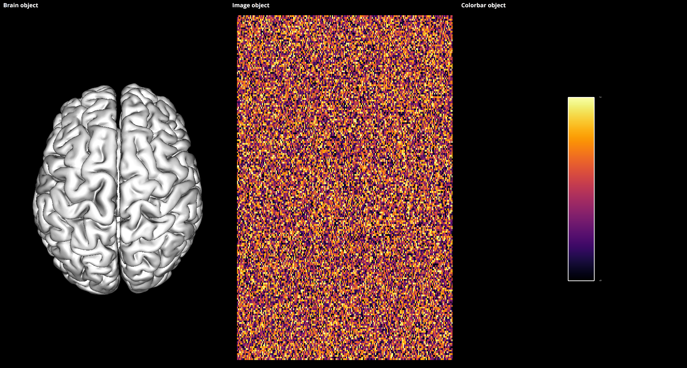

.. _Tuto:

.. raw:: html

  

Tutorial
********

.. raw:: html

    
Learn how to use Visbrain <b>#nodeepshit</b>

    

  

.. ###########################################################################
.. ----------------------------- IMPORT -----------------------------
.. ###########################################################################
.. raw:: html

    

      

        

          <h2 class="panel-title">
            <a data-toggle="collapse" href="#collapse_import">How to import and use visbrain?</a>
          </h2>
        

        

          

Visbrain works with python files (i.e **.py**) and is currently **not working** inside Jupyter notebooks. Inside a **.py** file, Visbrain can be imported as follow :

.. code-block:: python

    import visbrain

.. ###########################################################################
.. ----------------------------- SINGLE OBJECT -----------------------------
.. ###########################################################################
.. raw:: html

          

        

      

    

      

        <h2 class="panel-title">
          <a data-toggle="collapse" href="#collapse_objects">How to display individual Visbrain objects?</a>
        </h2>
      

      

        

In Visbrain, objects are elementary visualization bricks. **One object = one visualization type**. Objects can be imported from :class:`visbrain.objects`. For example :

* :class:`visbrain.objects.BrainObj` : plot a brain mesh
* :class:`visbrain.objects.HypnogramObj` : plot an hypnogram
* :class:`visbrain.objects.TimeFrequencyObj` : plot a time-frequency map

Checkout the :ref:`API_objects` part of the API. Then, each object has a `.preview()` method to be displayed.

.. code-block:: python

    from visbrain.objects import BrainObj

    # Create a brain object and display it :
    b_obj = BrainObj('B1', translucent=False)

    # Display the brain object :
    b_obj.preview()

.. figure::  picture/pictuto/tuto_1.png
   :align:   center

.. ###########################################################################
.. ----------------------------- COMBINE OBJECTS -----------------------------
.. ###########################################################################
.. raw:: html

          

        

      

    

      

        <h2 class="panel-title">
          <a data-toggle="collapse" href="#collapse_combine">How to combine multiple objects to create complex figures?</a>
        </h2>
      

      

        

Objects can be combined in a scene (see :class:`visbrain.objects.SceneObj`) to create a figure with several panels.

.. raw:: html

    <h3>How to combine objects in separate panels?</h3>

.. code-block:: python

    import numpy as np
    from visbrain.objects import SceneObj, BrainObj, ImageObj, ColorbarObj

    # Create a brain object :
    b_obj = BrainObj('B1', translucent=False)

    # Create a 200x200 image :
    im = np.random.rand(200, 200)
    im_obj = ImageObj('MyImage', data=im, cmap='inferno')

    # Create a colorbar from the image object :
    cb_obj = ColorbarObj(im_obj)

    # Now, create the scene object and add every objects to it :
    sc = SceneObj()
    sc.add_to_subplot(b_obj, row=0, col=0, title='Brain object')
    sc.add_to_subplot(im_obj, row=0, col=1, title='Image object')
    sc.add_to_subplot(cb_obj, row=0, col=2, title='Colorbar object')

    # Finally, display the scene :
    sc.preview()

.. raw:: html

    <h3>How to stack several objects inside the same panel</h3>

.. code-block:: python

    import numpy as np
    from visbrain.objects import SceneObj, BrainObj, SourceObj

    # Create a brain object :
    b_obj = BrainObj('B1', translucent=True)

    # Create a first source object with red square symbols :
    s1 = np.random.uniform(-50, 0, (20, 3))
    s1_obj = SourceObj('S1', xyz=s1, symbol='square', color='red',
                       radius_min=30)

    # Create a second source object with green disc symbols :
    s2 = np.random.uniform(0, 50, (20, 3))
    s2_obj = SourceObj('S2', xyz=s2, symbol='disc', color='green',
                       radius_min=30)

    # Now, create the scene object and add every objects to it :
    sc = SceneObj()
    sc.add_to_subplot(b_obj, title='Brain object + two source object')
    sc.add_to_subplot(s1_obj)
    sc.add_to_subplot(s2_obj)

    # Finally, display the scene :
    sc.preview()

.. figure::  picture/pictuto/tuto_2-2.png
   :align:   center

.. raw:: html

          

        

      

    
