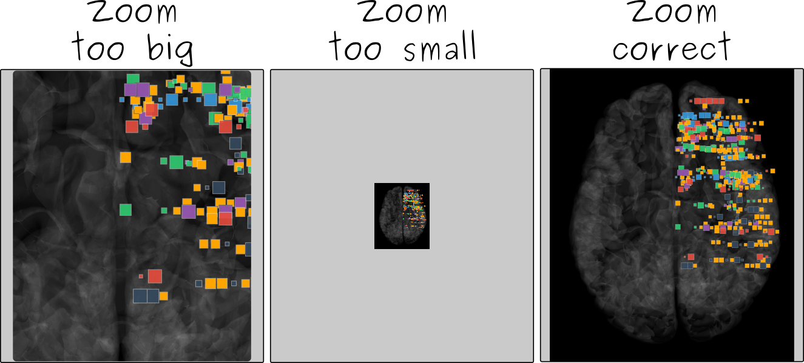
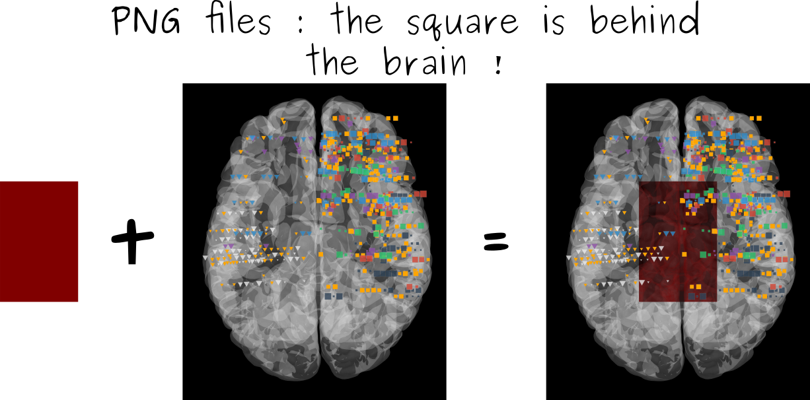
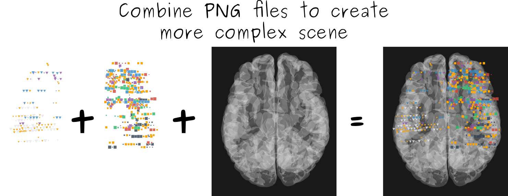

Exporting figures is really important, expecially if you want to use it in your research. There is two good news and a bad one :

* The first good news is that, in the Brain module, you can really achieve to have beautiful HD figures.
* The bad point, it will need some time investment to find perfect parameters.
* The second good news is that this time investment has to be done only once (at least per computer).

Exporting your figures
~~~~~~~~~~~~~~~~~~~~~~

The problem with exportation is the monitor size and especially where you want to crop your figures to have a perfectly fitting one. Inside the user functions, you will find a dedicated `Screenshot <https://etiennecmb.github.io/visbrain/vbfunctions.html#screenshot>`_ method for exporting the window into a *png*, *tiff*, *jpg*...

Screenshot function
~~~~~~~~~~~~~~~~~~~

Using this function, you can export both the main canvas (containing the MNI brain / sources / connectivity / ROI) and the colorbar. Basically, there's three important arguments :

* *name* : the name of the exported figure
* *region* : where to crop the picture
* *zoom* : zoom level over the canvas

Name of your figure
+++++++++++++++++++

The name of your exported file ('*myfile.png*', '*myfile.jpg*'...). It's a necessity for this file name to contains the **extension**.

Cropping region
+++++++++++++++

Specify the region of your screen to capture. This is usefull to have a fitted figure around your brain (see Figure 1)

.. figure::  picture/brain_region.png
   :align:   center
   
   Figure 1 : Explanation of the region argument.

Zoom
++++

Specify the zoom level over the canvas.

   
   Figure 2 : Explanation of the zoom argument.

If you don't want to ajust manually the zoom, you can `rotate <https://etiennecmb.github.io/visbrain/vbfunctions.html#rotation>`_ the brain before, this will force the zoom level to be perfectly ajusted. For example, if you want to take an axial view of the brain, run before the screenshot :

.. code-block:: python

    vb = Brain()
    vb.rotate(fixed='axial')
    vb.screenshot('myfigure.png')

Colorbar
++++++++

If you export your figure as *myfile.png*, and if you specify **colorbar=True**, the colorbar will be exported as *myfile_colorbar.png* with the same background color. There is also a *cbregion* and *cbzoom* to define the cropping region and the zoom level for the colobar canvas.

Transparency
~~~~~~~~~~~~

PNG files
+++++++++

If you export your figures as a *png* file, and if the brain is transparent, don't forget that the exported figure will be **transparent too !**

   
   Figure 3 : transparent brain and *png* files.

Combine transparent figures
+++++++++++++++++++++++++++

The `Screenshot <https://etiennecmb.github.io/visbrain/vbfunctions.html#screenshot>`_ method has a *transparent* argument, which allow the user to force the background to be transparent. Using this, you can then combine several *png* transparent files to generate more complex figures (see Figure 4). For example, you can export sources with transparent background and the main bran with non-transparent background and finally superimpose figures.

   
   Figure 4 : combine png files to create complex scene.
