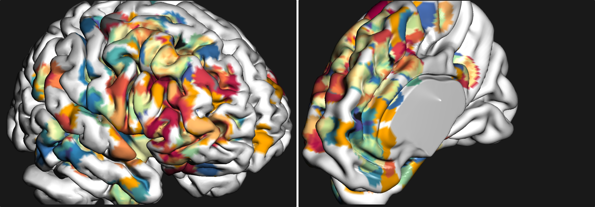
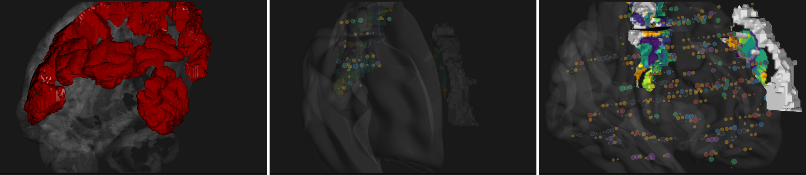

The functions below are subdivided into several parts :

* GUI functions : control the graphical user interface (display, rotation, screenshot...)
* Brain functions: control the main brain object (color, transparency...)
* Sources functions: control sources object (color, transparency, data...)
* Connectivity functions: control connectivity object (color, transparency, data...)
* Area functions: control area object (selected areas, color, transparency...)

GUI functions and settings
^^^^^^^^^^^^^^^^^^^^^^^^^^

Set of functions for an iteractive control of the graphical user interface elements. 

Show graphical interface
~~~~~~~~~~~~~~~~~~~~~~~~
.. automethod:: visbrain.vbrain.vbrain.vbrain.show

Quit graphical interface
~~~~~~~~~~~~~~~~~~~~~~~~
.. automethod:: visbrain.vbrain.user.userfcn.quit

Rotation
~~~~~~~~
.. automethod:: visbrain.vbrain.user.userfcn.rotate

Background color
~~~~~~~~~~~~~~~~
.. automethod:: visbrain.vbrain.user.userfcn.background_color

Screenshot
~~~~~~~~~~
.. automethod:: visbrain.vbrain.user.userfcn.screenshot

Brain functions
^^^^^^^^^^^^^^^

Set of functions for an iteractive control of the main brain object. Use the methods below to define which brain template or hemisphere to display, the transparency level...

.. figure::  picture/BrainObj.png
   :align:   center

   Several brain templates and control possiblities.

Control
~~~~~~~
.. automethod:: visbrain.vbrain.user.userfcn.brain_control

Opacity
~~~~~~~
.. automethod:: visbrain.vbrain.user.userfcn.brain_opacity

Light reflection
~~~~~~~~~~~~~~~~
.. automethod:: visbrain.vbrain.user.userfcn.light_reflection

Sources functions
^^^^^^^^^^^^^^^^^

Set of functions for an iteractive control of sources object. Use the methods below to pass some data to sources, to control the transparency level, to run the cortical projection / repartition...

.. figure::  picture/SourcesObj.png
   :align:   center

Set data
~~~~~~~~

.. automethod:: visbrain.vbrain.user.userfcn.sources_data

Opacity
~~~~~~~
.. automethod:: visbrain.vbrain.user.userfcn.sources_opacity

   Example of cortical projection.

Cortical projection
~~~~~~~~~~~~~~~~~~~
.. automethod:: visbrain.vbrain.user.userfcn.cortical_projection

Cortical repartition
~~~~~~~~~~~~~~~~~~~~
.. automethod:: visbrain.vbrain.user.userfcn.cortical_repartition

Colormap
~~~~~~~~
.. automethod:: visbrain.vbrain.user.userfcn.sources_colormap

Connectivity functions
^^^^^^^^^^^^^^^^^^^^^^

Set of functions for an iteractive control of connectivity object. Use the methods below to pass some data to connectivity, to control the transparency level...

.. figure::  picture/ConnectObj.png
   :align:   center

   Example of connectivity setup.

Area functions
^^^^^^^^^^^^^^

Set of functions for an iteractive control of areas object. Use the methods below to select the areas to display, to control the transparency level...

   Example of deep-structures (AAL / Brodmann area).

Plot selection
~~~~~~~~~~~~~~
.. automethod:: visbrain.vbrain.user.userfcn.area_plot

Opacity
~~~~~~~
.. automethod:: visbrain.vbrain.user.userfcn.area_opacity

Light reflection
~~~~~~~~~~~~~~~~
.. automethod:: visbrain.vbrain.user.userfcn.area_light_reflection
