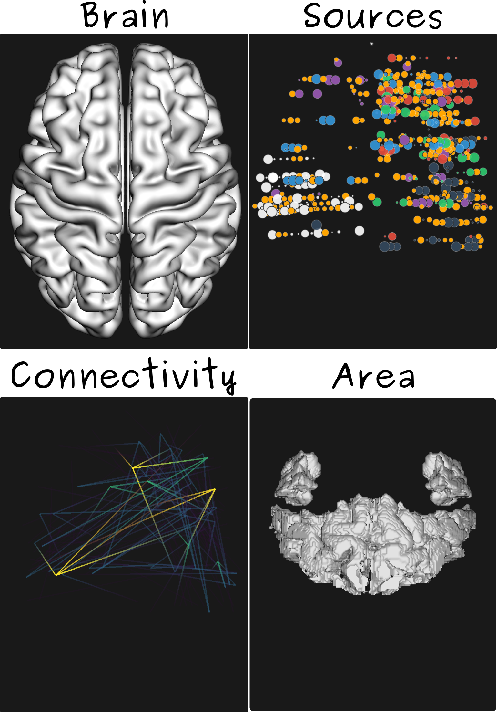
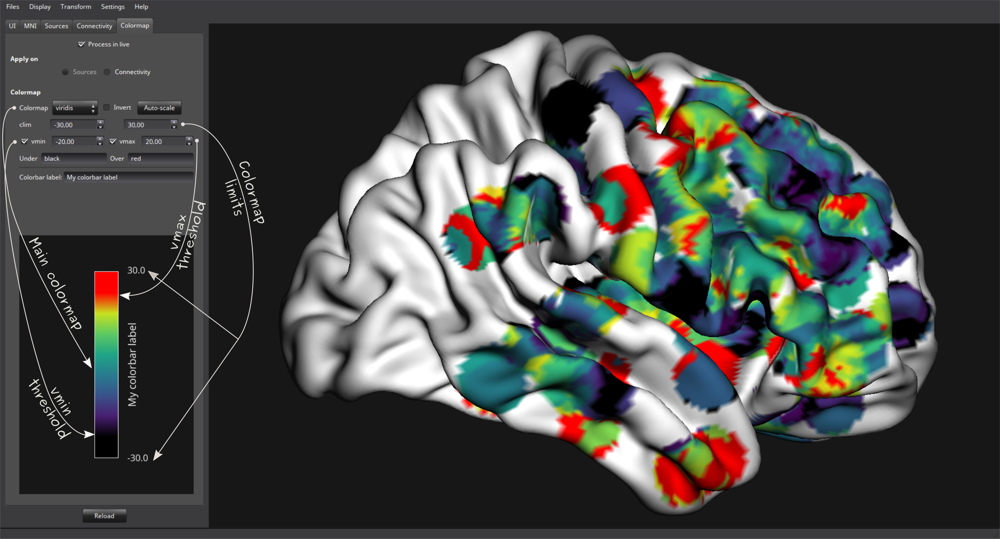

.. _vbrain:

vbrain
======

Description
-----------

.. figure::  picture/example.png
   :align:   center

Vbrain is a flexible graphical user interface for 3D visualizations on an MNI brain. It can be use to display deep sources, brodmann areas, materialize connectivity... This module use `vispy <http://vispy.org/>`_ and can be imported as follow :

.. code-block:: python

    from visbrain import vbrain

Objects
-------

There's four fundamental objects in vbrain :

* The main brain, which can be generated using one of the three possible template or simply pass vertices / faces of your own template.
* Sources, which can represent deep electrodes, EEG / MEG captors or source localization...
* Connectivity, in order to materialize a connexion strength between those sources (like coherence, amplitude-amplitude coupling...)
* Areas, which are brain sub-structures (brodmann areas or AAL)

Inputs
------

Each one of the above objects can be controled using input parameters for the vbrain class. All possible inputs use a prefixe, refering to the object itself :

	* 'a(_)': atlas properties
	* 's(_)': sources properties
	* 'c(_)': connectivity properties
	* 'cmap(_)': colormap properties
	* 't(_)': transformations properties
	* 'ui(_)': graphical interface properties
	* 'cb(_)': colorbar properties
	* 'l(_)': light properties

Here's the list of all possible inputs :

.. autoclass:: visbrain.vbrain.vbrain.vbrain

Color
-----

Vbrain can manage several types of color inputs. All possible colors can be a matplotlib color name ('olive', 'slateblue'...), an hexadecimal type ('#9b59b6', '#3498db', '#95a5a6'...*) or an array of RGB or RGBA colors ((1., 0., 0.), (.1, .1, .1)...).

The colormap can be personalized using five variables :

* clim : define the colorbar limits (like (-10, 10) or (-245, 7)...). The clim parameter must be a tuple/list of two floats. Every values over or under the colorbar limits will clip.
* vmin / under : vmin is a float and under is a color. The vmin parameter can be defined in order to control the color of data that is under vmin.
* vmax / over : vmax is a float and over is a color. The over parameter can be defined in order to control the color of data that is over vmax.

User functions
--------------

The user functions correspond to a bundle of functions that the user can use to control vbrain operations without opening the graphical interface. This can be convenient to generate a large amount of pictures. 

.. toctree::
   :maxdepth: 4
   
   vbfunctions